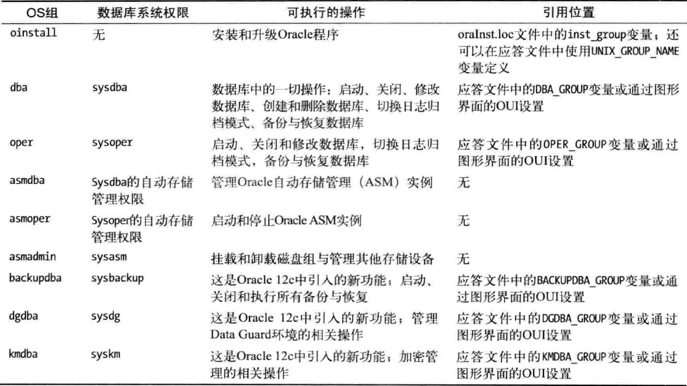
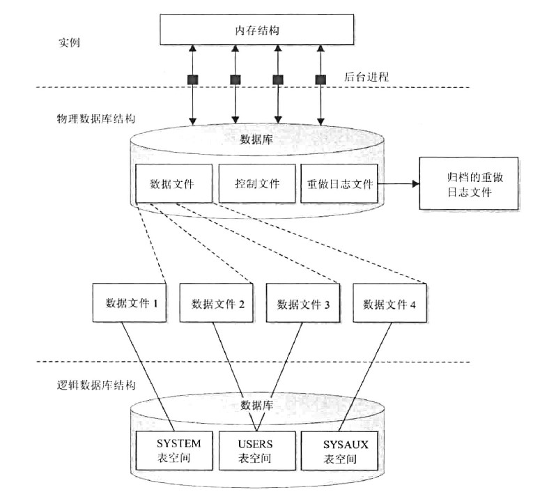

# os组及相应的备份与恢复权限

# oracle目录结构(OFA)
Oracle Felix Architecture

```
参数文件,密码文件:ORACLE_HOME/dbs/
监听:ORACLE_HOME/network/admin/
审计(audit_file_dest):ORACLE_BASE/admin/实例名/adump/
跟踪(user_dump_dest):ORACLE_BASE/diag/rdbms/数据库唯一名/实例名/trace/
告警日志(backgroud_dump_dest):ORACLE_BASE/diag/rdbms/数据库唯一名/实例名/trace/

前台进程跟踪  USER_DUMP_DEST    ADR_HOME/trace
后台进程跟踪  BACKGROUND_DUMP_DEST  ADR_HOME/trace
预警日志数据  BACKGROUND_DUMP_DEST  ADR_HOME/alert ADR_HOME/trace
核心转储    CORE_DUMP_DEST ADR_HOME/cdump
意外事件转储  USER|BACKGROUND_DUMP_DEST      ADR_HOME/incident/incdir_n 
```
# 表空间
```
1.small tablespace
最大32G,不支持直接表空间resize

2.bigfile tablespace
最大128TB,默认8k的则是32TB,支持直接resize,且只有一个数据文件

注意:自动扩展只能通过修改数据文件的方式
```
# Oracle字符集和字符编码
字符集:操作系统(显示字符集),客户端(仅使用什么编码向数据库发送数据,而不表示显示字符和字符编码),服务端(数据库)
客户端和数据库字符集一致就不会转码,但实际的编码是操作系统的编码
根据字符编码(字母数字组成)能够找到对应的字符集(看到的符号文字等)
客户端字符集和服务端字符集:客户端的字符集在服务端字符集不一致会导致显示或插入等乱码
客户端修改字符集:  临时:set nls_lang 永久:注册表
查看在数据库中编码 dump(col,1016)函数
**Oracle字符集命名规则**:语言位大小,编码
**存储字符集**:
+ 数据库字符集(AL32UTF8)  
    + 用来存储char,varchar2,clob等类型的字段数据
    + 用来标识表名,字段名以及plsql变量等
    + 存储sql和plsql代码等
    + 数据库一旦配置完成不能更改
    + 只能选择可变长度多字节编码,主要是为了包容EBCDIC或ASCII单位元编码的子集
+ 国家字符集    
    + 用以存储nchar,nvarchar2,nclob等类型字段数据
    + 是Oracle可选附加字符集,是为了增加Oracle对字符的处理能力,只能选择AF16UTF16和utf8
    + 一旦配置不能更改
    + 可选择固定长度多字节编码或可变长度多字节编码
    + 若未指定默认与数据库字符集一致
nls_lang参数:(语言,地域,字符集组成):
language:指定服务器消息的语言,影响提示信息是中文还是英文
territory:指定服务器的日期和数字格式
charset:指定字符集
查看server端字符集
```sql
select userenv('language') from dual;
SELECT * FROM V$NLS_PARAMETER;
```
# sqlnet.ora,tnsname.ora,listener.ora
```sql
#$ORACLE_HOME/network/admin/samples有相关配置文件说明
#1.sqlnet.ora:用在Oracle client端

-------------------------
# 指定启动一个或多个认证服务
SQLNET.AUTHENTICATION_SERVICES= (NTS)

# 指定CLIENT NAME解析方法的次序，默认是NAMES.DIRECTORY_PATH=(tnsnames, onames, hostname)
NAMES.DIRECTORY_PATH= (TNSNAMES, EZCONNECT)

/*
连接数据库时语法:CONNECT username/password [@db_alias] AS [SYSOPER | SYSDBA] ;
db_alias就是tnsname.ora中的别名,当第一个指定为TNSNAMES时，就先到tnsnames.ora文件中去找对应的db_alias；如果找不到，就再按指定的第二种方式去找；如果都找不到，就将指定的db_alias当做主机名在网络上进行解析，得到数据库服务器的地址
EZCONNECT表示简单连接,即不用tnsname.ora连接:username/password@hostname:port/service_name
*/
---------------------------

#2.tnsname.ora:用在Oracle client端(server端也可以当作client端),用户配置连接数据的别名参数,像hosts文件一样,和sqlnet.ora文件配合使用

------------------------------
#ORCL是个别名
#这条信息记录了我们使用TCP协议，去连接IP地址为127.0.0.1，端口号为1521的数据库主机上服务名为orcl的数据库
ORCL =
    (DESCRIPTION =
        (ADDRESS = (PROTOCOL = TCP)(HOST = 127.0.0.1)(PORT = 1521))
        (CONNECT_DATA =
            (SERVER = DEDICATED)
            (SERVICE_NAME = orcl)
        )
    )
------------------------------
#3.listener.ora:Oracle server端,tnslsnr进程是监听、并接受远程连接数据库请求的监听进程，listener.ora是tnslsnr进程的配置文件，监听的参数都是从该配置文件中读取

------------------------------
/*  这是一个名为LISTENER1的监听器
监听的协议是TCP协议
监听的主机IP是127.0.0.1
监听的端口是1521端口        */
LISTENER1 =
    (DESCRIPTION =
    (ADDRESS = (PROTOCOL = TCP)(HOST = 127.0.0.1)(PORT = 1521))
)

#记录了监听器LISTENER1服务的全局数据库名、数据库路径和数据库实例名
SID_LIST_LISTENER1 =
    (SID_LIST =
        (SID_DESC =
            (GLOBAL_DBNAME = ORCL)
            (ORACLE_HOME = C:\Oracle11g\product\11.2.0\dbhome_1)
            (SID_NAME = ORCL)
        )
    )
```
# 数据库逻辑存储结构

# 数据库物理存储结构

# 临时表
```sql
--创建临时表,临时数据由on commit子句控制,会话终止,所有用户数据都会删除
create global temporary table (...)
on commit delete rows
--删除临时表中所有行,事务期间数据
on commit preserve rows
--超出事务边界后保留数据,会话期间数据
```
只要有访问的权限,就可以执行select或dml.     
每个用户只能查看或操作自己的数据.       
**两种临时数据:**
+ 会话期间的临时数据
+ 事务期间的临时数据
# 数据库链接和远程数据库
```sql
create [public] database link db_link
 connect to db_username identified by db_password 
 using '(DESCRIPTION =
    (ADDRESS = (PROTOCOL = TCP)(HOST = 192.168.12.123)(PORT = 1521))
    (CONNECT_DATA =
      (SERVER = DEDICATED)
      (SERVICE_NAME = orcl)
    )' ;
--当参数global_name=true时,链接名要与远程数据库一致
select * from tablename@db_link;
--使用数据库链接
```
# 控制文件备份与恢复
```
！ oerr ora 250
env 看环境变量

list failure;
advise failure;
repair failure;

控制文件多路复用:
1.操作系统cp(注意步骤)
2.rman备份:backup current controlfiles [format ...];
3.alter database backup controlfiles to '';
4.alter database backup controlfiles to trace as '';
```

