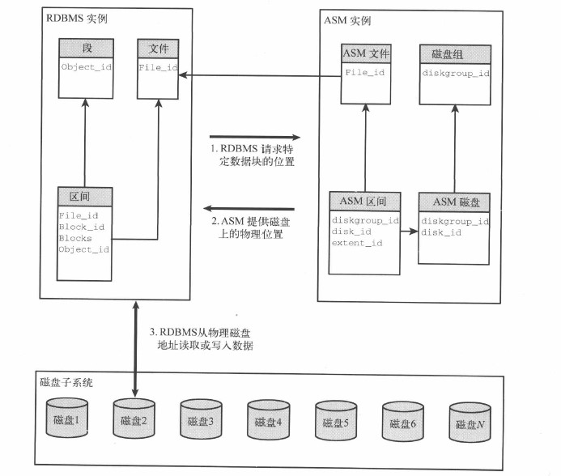

# 22.1 自动存储管理(ASM)

&emsp;&emsp;将文件层的数据管理任务自动化,给数据库提供了条带,冗余,负载均衡和其他服务.11GR2开始提供ACFS(自动管理的集群文件系统)
## 22.1.1 ASM架构
&emsp;&emsp;ASM是一个没有实现任何装饰的Oracle实例.这个实例不支持数据文件,也不支持数据库会话.ASM实例的用途是维护和确定数据库对象和为这个对象存储数据的磁盘块之间的对应关系.  

&emsp;&emsp;从关系型数据库来看,数据段由数据文件里存储的区间组成.这些文件存储在ASM磁盘组里.除了磁盘组和逻辑ASM文件名外,关系数据库不在维护磁盘上的数据文件物理存放的任何信息.     
&emsp;&emsp;当有新块被创建时ASM建议关系型数据库将这个块写到磁盘的哪个位置.当关系型数据库需要读一个逻辑块时,它询问ASM获得快的物理位置.关系型数据库负责所有的物理IO读写.ASM建议关系型数据库去哪儿读写.
## 22.1.2 ASM监控
&emsp;&emsp;ASM可以从ASM磁盘组和设备层面为IO提供进一步分析.     
1.连接到ASM实例
&emsp;&emsp;一个Oracle实例最多只允许与一个ASM实例关联.v$asm_diskgroup和v$asm_disk_stat视图可以查看ASM统计数据,这些统计不会反应其他关系型数据库的行为,可能会有其他数据库连接到相同ASM存储的行为.所以要连接到ASM实例获取统计数据．    
&emsp;&emsp;只能通过具有sysdba,sysoper,sysasm权限的用户连接.    
2.度量磁盘组性能    
3.磁盘级的统计数据  
4.监控ASM重平衡操作    
5.文件级的统计数据      
6.企业管理器及其他根据