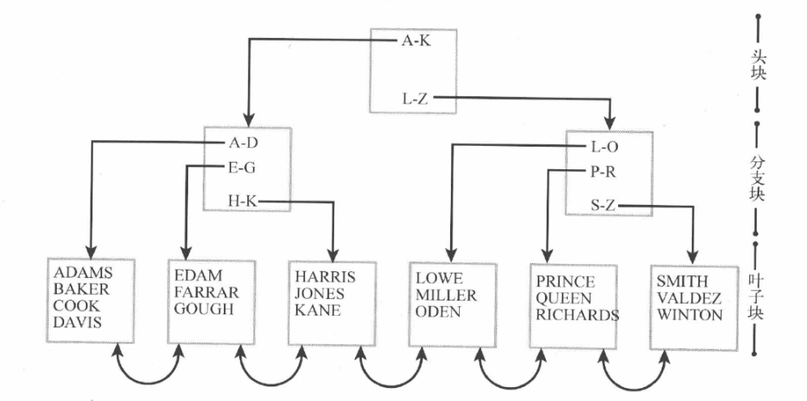

# 评估索引(见索引压缩)
# 5.1 索引与簇概况
+ B*树索引
+ 位图索引
+ 位图联结索引
+ 索引组织表(IOT)
+ 散列簇
+ 索引簇
+ 嵌套表

# 5.2 B*树索引
B*树索引是Oracle默认索引,其拥有一个层次化的树形结构,如下图  
    
>&emsp;&emsp;树的顶端是头块,包含指向分支块的指针.而分支块代表了给定的键值范围,分支块通常指向了一个更加确定范围的叶子块,或者当索引很大时指向另一层分支块.叶子块包含一个由索引键值及指向表中相应记录的指针(ROWID)组成的列表.同时叶子块包含指向前一个以及后一个叶子块的指针.(头块和分支块几乎总是被加载进内存)  
&emsp;&emsp;查询性能虽然高效,但也带来维护代价,插入一条新纪录如果块的空间不够大会造成索引分裂.
## 5.2.1 索引选择性
**选择性**:列或索引包含大量的非重复值,则认为其是有选择性的  
`一个或一组列的选择性是判断在这些列上创建索引有用性的常用衡量标准.`
## 5.2.3 唯一索引、隐含索引、组合索引
+ 唯一索引
+ 隐含索引  
`主键或唯一键等包含隐含索引`
+ 组合索引  
>&emsp;&emsp;组合索引的第一列叫**前导列**,如果在查询时未指定前导列,Oracle仍然可以通过**跳跃扫描**来使用索引.当前导列选择性较差时索引跳跃扫描更高效.跳跃扫描相当于Oracle把每一个不同的前导列的值做一次索引访问,加入到了查询条件中
如有gender(只有'F'和'M')和age组成的组合索引,当想查询age=20时
```SQL
select * from test where age=20;
而Oracle却相当于把他改写成了
select * from test where gender='F' and age='20'
union all
select * from test where gender='M' and age='20';
``` 
>&emsp;&emsp;**索引合并**:where子句出现了表上的多个列,但却没有出现相关列的组合索引,只有单个列索引,则Oracle可能会执行组合索引.
如first_name,last_name两列,当查询liu shi 这个名字时,Oracle会把两次查询的结果集做一次合并.
## 5.2.4 null、反转键索引、索引压缩
+ null值    
`B树索引不能对null值建立索引`
+ 反转键(Reverse Key)索引   
>&emsp;&emsp;创建索引时指定Reverse关键字,使存储到索引中的键值为反转值.其可以减少索引前沿的征用.若按照升序插入记录(可能使用了序列,一般也由这种类型的造成索引块争用 ),最右边的块(前沿块)将总是活跃的(因为按照B树索引,会根据顺序插入键值,所以最右边的块会保持活跃的i/o操作),而且定期删除而又不完全删除老的数据,也会浪费空间.因为没有被删除的数据将稀疏的保留在块中.
```sql
create index index_test_rev on scott.dept(id) reverse;
```
+ 索引压缩
>&emsp;&emsp;对叶子块的条目进行压缩.该压缩将不会发生变动的前导列在索引键中移走,并将他们保存在一个前置条目(我的理解:就是由多个重复的值变为一个的意思,从而达到了减少存储空间,叶子块存储条目变多范围扫描需要更少的io,b树索引的高度可能降低)中.
```sql
--用法:
create index cust_i_compr on sh.customers(cust_last_name,cust_first_name,cust_year_of_birth) compress 2;
analyze index cust_i_compr validate structure;
select height, lf_blks, br_blks, btree_space, opt_cmpr_count, opt_cmpr_pctsave from index_stats;
```
>&emsp;&emsp;**索引压缩**是通过将索引中的键值拆分成两部分实现的，也就是grouping piece 也称作prefix 和 unique piece 也称作suffix 。grouping piece 是用来压缩的被unique piece 共享的部分。如果键值不能提供unique piece，那么oracle 将会使用rowid 来唯一标识。只有B-tree 索引的叶子节点能够被压缩，分支节点不能够被压缩。索引压缩是在单个block 中完成的，不能够跨blocks进行索引压缩。grouping piece (prefix) 和 unique piece (suffix) 存储在同一个索引 block 中。  
&emsp;&emsp;具体prefix 和 suffix 是怎么划分的呢？默认prefix 长度等于索引列的数量减去1。当然我们可以人为控制prefix 的长度，非唯一索引的最大prefix 长度等于索引列的数量。唯一索引的最大prefix 长度等于索引列的数量减去1。比如，假设索引有三个列:   
&emsp;&emsp;默认的时候：prefix (column1,column2) suffix (column3),如果有以下几组键值（1,2,3),（1,2,4),(1,2,7),(1,3,5),(1,3,4),(1,4,4) 那么在prefix中重复的（1,2），(1,3) 将会被压缩至保留一份。
而另一个SQL语句则评估是否压缩索引,OPT_CMPR_COUNT:估算出的可以压缩的索引字段数,OPT_CMPR_PCTSAVE ：估算出的可以节省的空间.    
&emsp;&emsp;由上面特性可以看出,在前导列重复值较多时,索引压缩效果较佳.且不可以对单列的唯一索引,分区索引,位图索引进行压缩.    
[索引压缩详解](https://blog.csdn.net/tanzuai/article/details/42493383)

## 5.2.5 函数索引
>&emsp;&emsp;创建基于函数或表达式的索引.函数与表达式的结果必须具备确定性,即给定的输出必须返回同样的输出.    
>&emsp;&emsp;在创建函数时可以指定**determinstic**关键字表明它总是返回相同的结果.
## 5.2.6 外键与锁
>&emsp;&emsp;**参照完整性约束**:通过定义外键防止在没有匹配父表记录的情况下向子表插入记录,保证了数据的完整性(如Scott用户的dept和emp).    
>&emsp;&emsp;当父表主键变更或记录删除时,除非在外键字段创建了索引,否则Oracle会在子表应用表级锁(**有索引而没表锁原因\:**因为可以通过索引找到相应的记录而不用加表锁).  
>&emsp;&emsp;所以要么不要外键,要么就给外键加索引(外键可以优化delete cascade 操作).
## 5.2.7 索引与分区
>&emsp;&emsp;**全局索引**:分区表上的索引未分区.     
>&emsp;&emsp;**本地索引**:与源表拥有同样的分区规则.
>&emsp;&emsp;**本地前缀索引**:索引的前导列同时也是分区的分区键列.   
>&emsp;&emsp;**分区消除**:Oracle限制查询只处理相关的分区,使用本地索引会造成分区消除.
# 5.3 位图索引
>**位图索引**为每一个单列的每一个唯一值创建一个位图.每个位图为表中的每条记录包含一个位(0或1).1表示该记录在位图中存在,0则不存在.     
  
>**劣势**:更新位图索引的列将造成大量d额行级锁.以及不适合范围查询(所以不适合OLTP)
```sql
--语法
create bitmap index bm_emp on scott.emp(deptno);
```
## 5.3.1 位图索引与基数
>位图索引适合低基的列(即低选择性的列),但当选择性很高时其依然拥有很好的性能.
## 5.3.2 位图索引合并
>**效率**:组合索引>位图索引合并>b*树索引合并
## 5.3.3 位图联结索引
>&emsp;&emsp;它对在第二张表中有匹配记录的第一张表中的记录进行标识.可以避免两张表的联结.
```sql
--例sh模式的customers和sales表
create bitmap index bm_join_custer_sales on sh.sales(s.cust_id)
from sh.sales s,sh.customers c
where s.cust_id=c.cust_id nologging local;
--注意:事实表要和维度表有主外键约束,且因为sales表是分区表,则必须创建本地索引
```
>&emsp;&emsp;**需求**:通过电子邮件地址标识的给定客户的销量.     
>&emsp;&emsp;**详解**:一般情况下如果要实现这一需求,都需要如下表联结,先从customer得到cust_id,接着由cust_id得到sales表的匹配记录:
```sql
select sum(s.amount_sold) from sh.sales s join sh.customers c using(cust_id) where c.cust_email='york.raimey@company2.com';
```
>但当我们创建了位图联结索引后,可以由邮件地址直接得到结果(从执行计划可以看出未访问customer表).
# 5.4 索引开销
>&emsp;&emsp;索引提高了查询性能,但也降低了insert,update,delete,merge的DML语句的性能.
```sql
--索引监控,通过PL/SQL应用monitiring usage子句,另一种查询v$sql_plan(不推荐)
begin
  for r in (select index_name from user_indexes) loop
    execute immediate 'alter index ' || r.index_name ||' monitoring usage';
  end loop;
end;
--然后可以通过v$object_usage试图查看使用情况
```
# 5.5 索引组织表(IOT)
>&emsp;&emsp;IOT表是由一个**基于表的主键构建的B＊树索引**来组织的表,使用方式与其他表一样．主键即其他的列都存储在叶子块中．这导致范围扫描的性能下降，甚至可能提高了索引深度．可以通过INCLUDING子句指定存储部分列到叶子块中,而未被INCLUDING子句指定的列将被存储到一个溢出段中(存储优化:可以将溢出段存储到一个单独的表空间中).
```sql
--语法
create table survey_iot_overflow (
cust_id number not null,
question_id number not null,
question_score number not null,
question_long_anwser varchar2(1000) not null,
primary key (cust_id,question_id) )
ORGANIZATION INDEX INCLUDING question_score OVERFLOW;
--其B*树索引使用主键字段cust_id和question_id创建,question_score以及它之前的字段都存储在索引叶子块中,而剩余的列则存储在溢出表空间中.
--注意列的拆分,同时应频繁的重建IOT表防止记录删除而影响扫描性能.
```
# 5.6 簇
>&emsp;&emsp;概念:通过将数据物理定位在某些位置优化数据访问.     
>&emsp;&emsp;两种簇机制:    
>&emsp;&emsp;**索引簇**:将来自多张表拥有同样键值的记录存储在一起,相当于提前做好联结(在同一块中). 
```sql
--创建聚簇
create cluster emp_dept_cluster ( deptno number(2) )size 1024;
--创建聚簇索引
create index emp_dept_cluster_idx on cluster emp_dept_cluster;
--创建聚簇索引表(dept)
create table dept
( deptno number(2) primary key, dname varchar2(14),loc varchar2(13)) cluster emp_dept_cluster(deptno);
--创建聚簇索引表(emp)
create table emp
( empno    number primary key,ename varchar2(10),job varchar2(9),mgr number,hiredate date,sal number,comm number,
deptno number(2) constraint emp_fk references dept(deptno)) cluster emp_dept_cluster(deptno);
--查看创建的聚簇索引表
select cluster_name, table_name from user_tables where cluster_name is not null order by 1;
```
>&emsp;&emsp;**散列簇**:有一个数学转换将簇键值翻译成物理存储地址(即散列键),拥有同样散列键的记录会被存储在一起,从而直接定位数据.
```sql
create cluster ghOrderCluster(
  customer_id number(8),
  order_date date 
)
HASHKEYS 200 HASH IS customer_id size 5000;
--算法
HASHKEYS = 不同的散列键个数
SIZE = 总行数/HASHKEYS * 行平均长度 * 1.1
```
>
# 5.7 嵌套表
>&emsp;&emsp;将一张表的列定义为嵌套表对象类型.
```sql
--创建嵌套表对象
create or replace type survery_ot as object (
  item_number number,
  score int
);
--创建嵌套表对象类型
create or replace type survey_nt_type as table of surver_ot;
--包含嵌套表
create table custers_ntiot_survey(
  cust_id number not null primary key,
  ... ,
  survey survey_nt_type
)
```


