# Always on groups 安装配置

[创建和配置可用性组（内容索引） - SQL Server Always On](https://docs.microsoft.com/zh-cn/sql/database-engine/availability-groups/windows/creation-and-configuration-of-availability-groups-sql-server?view=sql-server-ver15)

## 条件

- 不是域控制器
- 位于同一个域中
- 安装了Failover Clustering功能
- SQL Server 服务账户确保都是域账号
- 用于群集使用的IP
- 防火墙
    1. SQL Server端口：1433或其他
    2. 数据库镜像endpoint:5022或其他
    3. 可用性组负载均衡器 IP 地址运行状况探测 ：59999或其他 (Azure配置侦听器用)
    4. 群集核心负载均衡器 IP 地址运行状况探测：58888或其他 (Azure配置侦听器用)
- 域账户要满足：
    1. 计算机管理员  （在域控制器中设置）
    2. SQL Server sysadmin权限
- 数据库最好是包含数据库，避免用户logins数据丢失

## 创建Windows Failover Clustring

1. 在sql server 服务器上，选择添加角色和功能

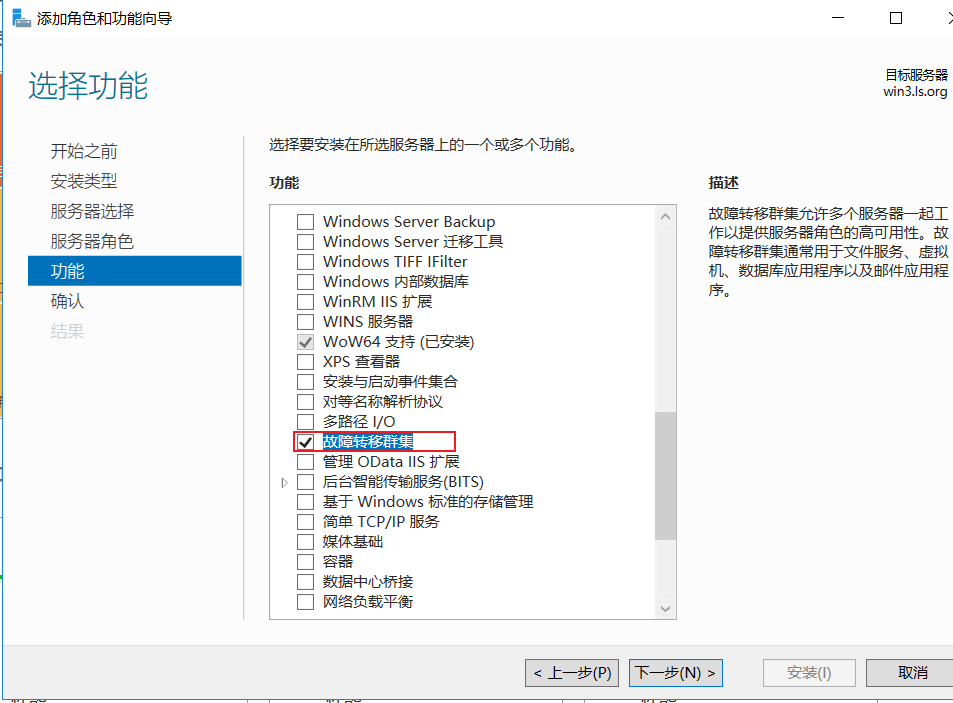

1. 服务器管理器→ 工具→故障转移集群管理→操作→创建集群

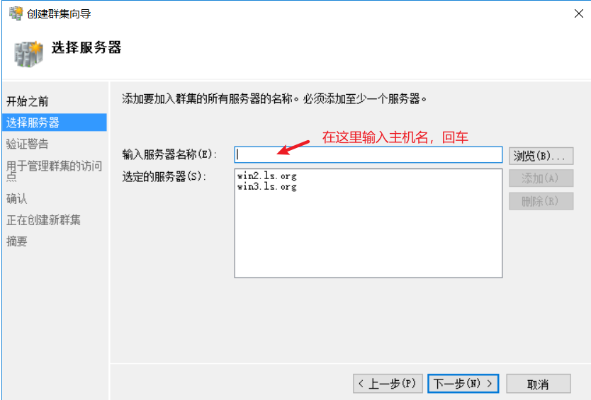

配置验证测试选择 “否

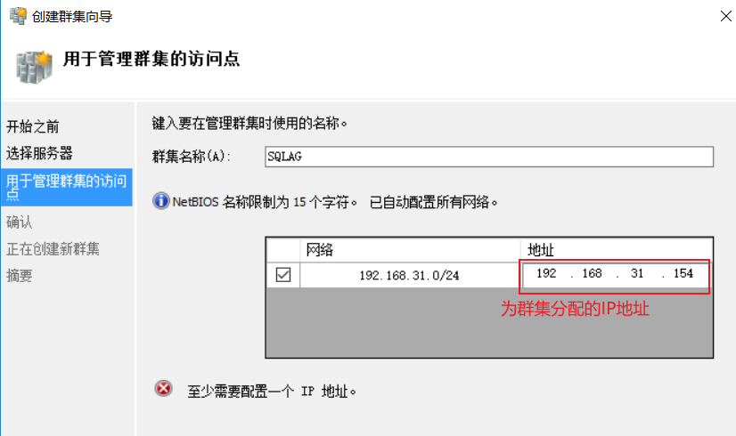

## 将其他SQL Server添加到群集

## 配置群集仲裁

### 创建群集仲裁文件共享

服务器管理器 - 工具 - 计算机管理  - 共享文件夹 - 新建共享文件夹

确保创建的文件夹用户有足够的权限

### 配置文件共享仲裁

在“故障转移群集管理器”中，右键单击群集，点到“更多操作”，然后选择“配置群集仲裁设置…”

在“选择仲裁配置选项”中，选中“选择仲裁见证”

在“选择仲裁见证”上，选择“配置文件共享见证” ，选择刚刚创建的共享文件

## 启用可用性组

在两个实例上都执行以下操作：

打开SQL Server Configuration Manager - SQL Server服务 - 右键属性-always on 可用性组 -启用

重启实例
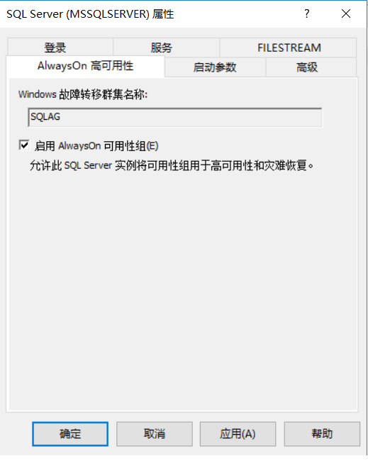

## 创建可用性组

`新建或损坏后再次创建的需要为数据库做一次全备。`

打开SSMS，在主库上选择 “可用性组” - “新建可用性组向导”

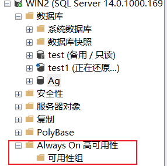
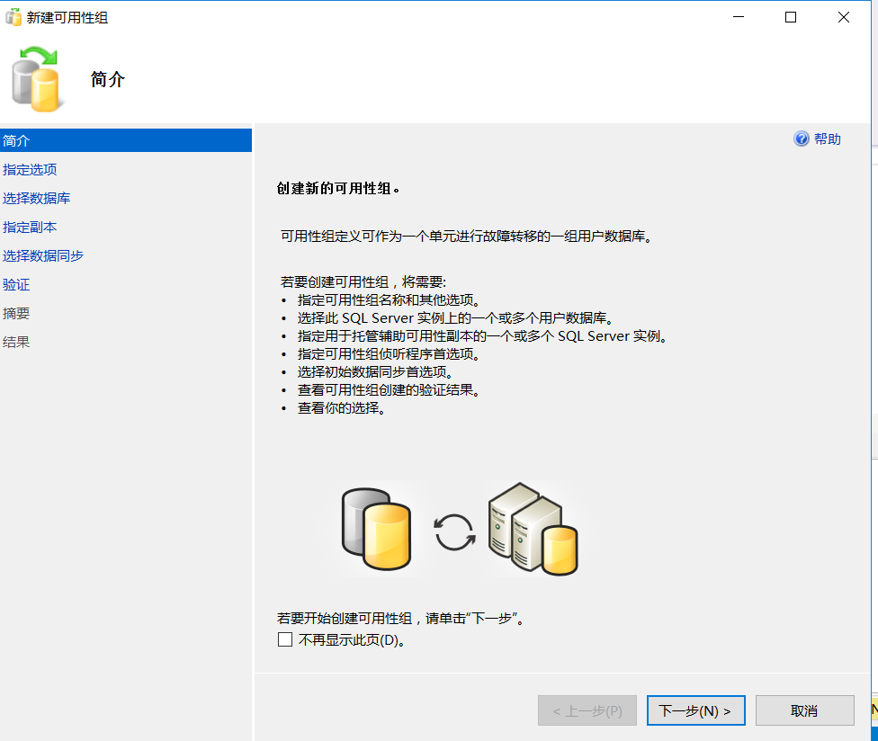

群集类型：

- Windows Server Failover Clustring  - windows 平台
- External - Linux 平台
- None - Windows 和 Linux , 表示AG不需要基础群集。即没有群集FailOver等功能

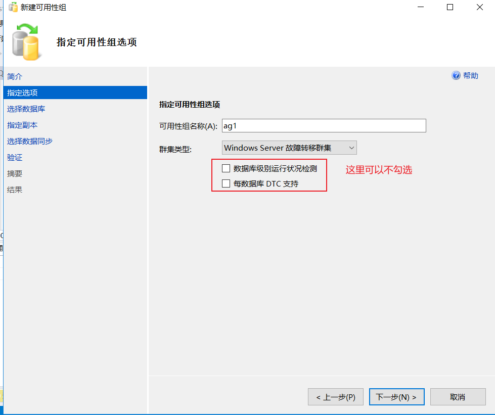

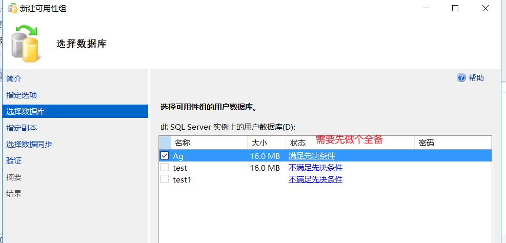

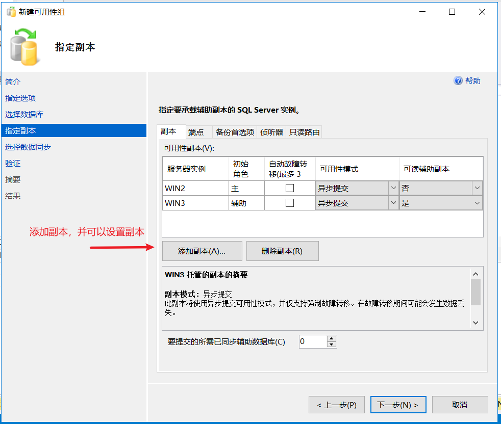

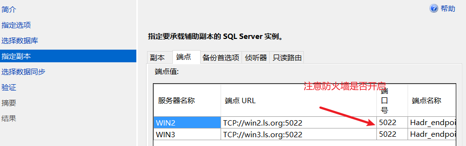

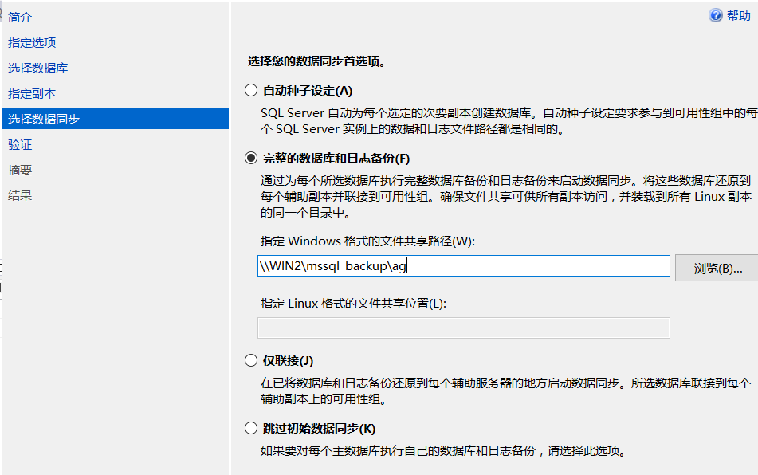

**对于侦听器可以不创建，但建议创建，用来供app连接使用**

## 查看可用性组

创建的可用性组上，右击“显示面板”

辅助副本显示“数据丢失”，其是正常的。这是因为：

在异步提交可用性副本上，每个可用性数据库都应该处于“正在同步”状态。在同步提交可用性副本上，每个可用性数据库都应该处于“已同步”状态。

所以把可用性模式改为“同步提交”后就显示无数据丢失了。

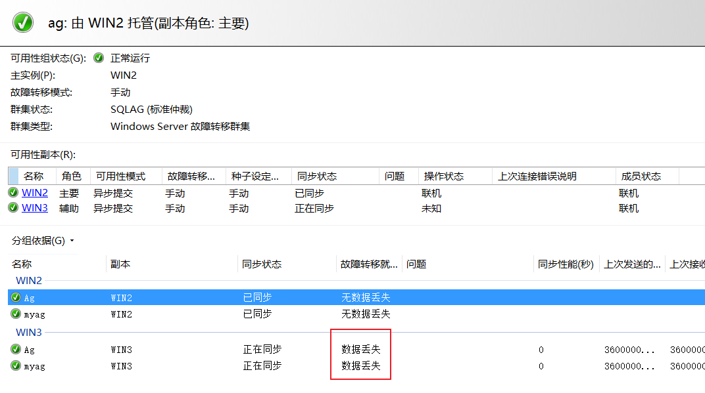

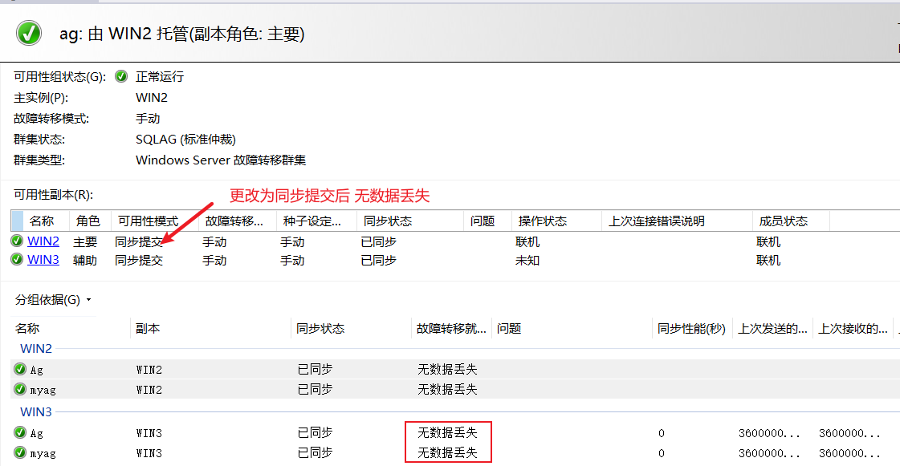

## 排错

1. 仪表盘显示“未同步”，但日志显示是成功的

在备库使用 “连接到可用性组”

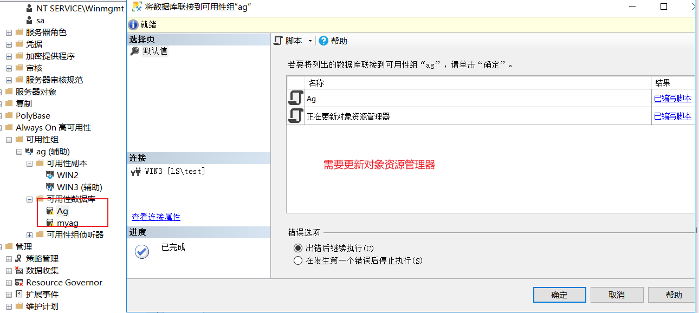