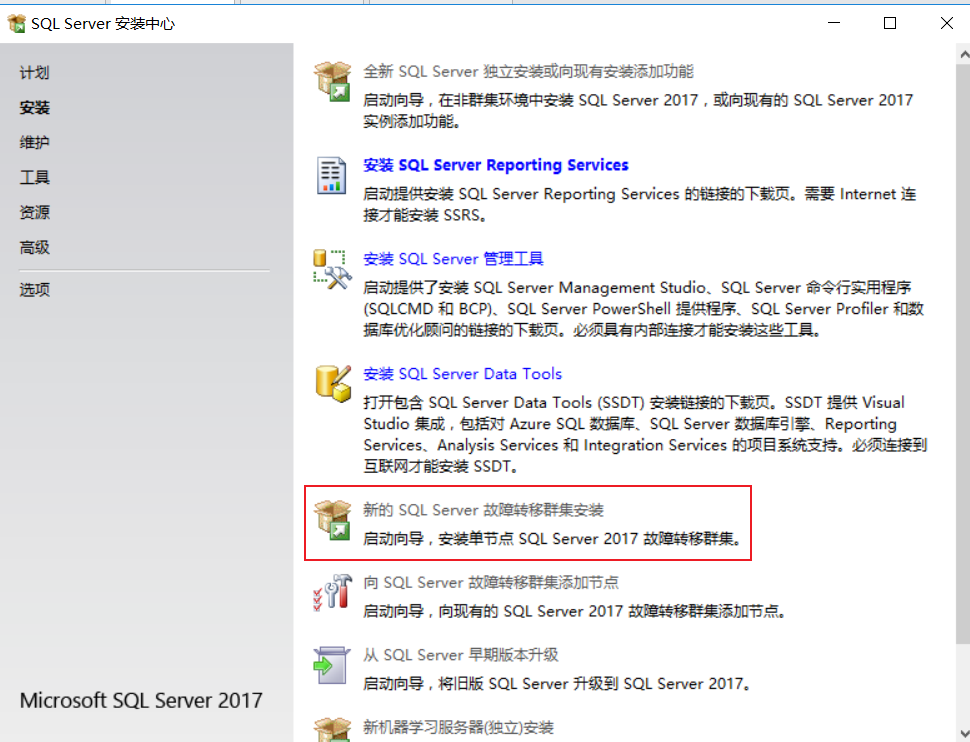
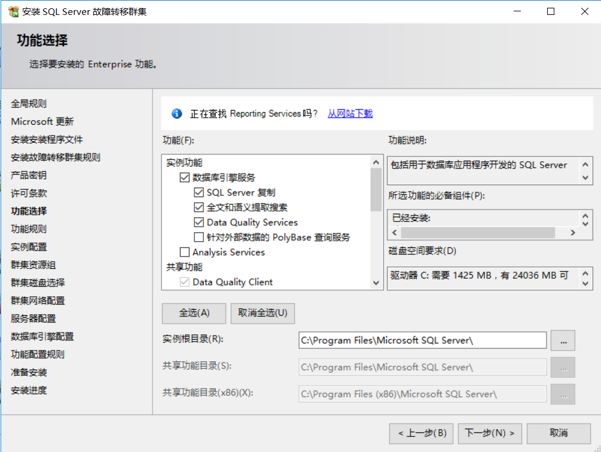
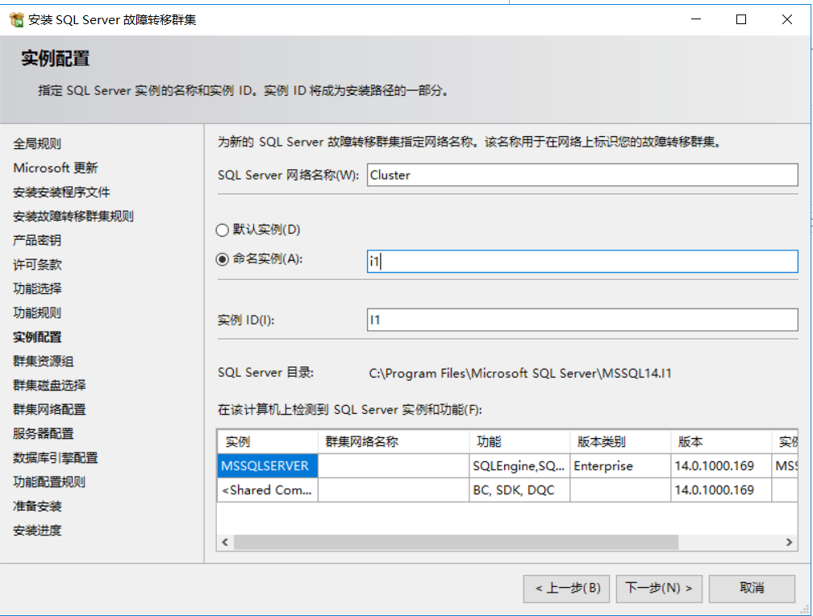
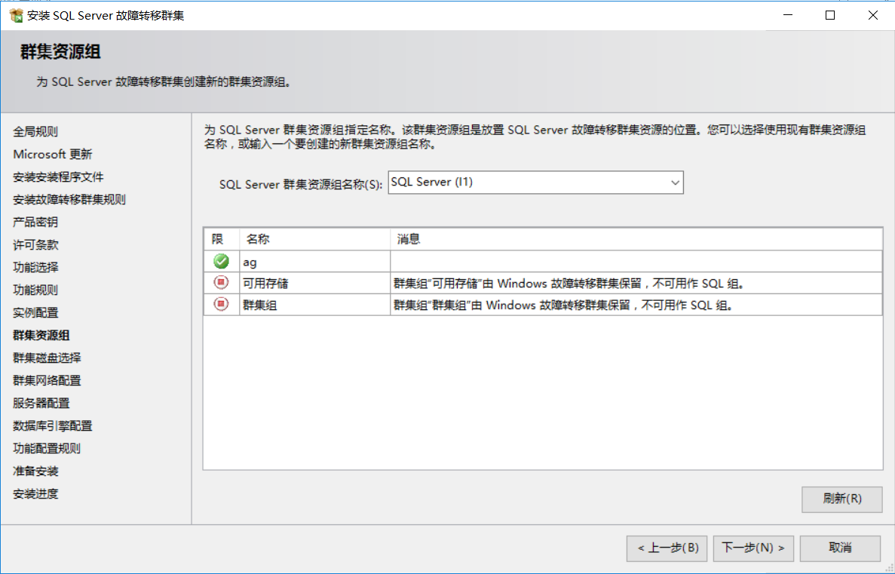

# Always On Clustering安装配置

要求：

- 节点配置要一致：COM+ 、磁盘驱动号、用户等
- 在安装或更新 SQL Server 故障转移群集之前，应禁用在安装过程中可能会使用 SQL Server 组件的所有应用程序和服务，但应使磁盘资源保持联机状态。
- SQL Server 安装程序自动设置 SQL Server 群集组与将处于故障转移群集中的磁盘之间的依赖关系。 因此不要在运行安装程序之前设置磁盘的依赖关系。
    - 在 SQL Server 故障转移群集安装期间，将为 SQL Server 网络资源名称创建计算机对象（Active Directory 计算机帐户）。 在 Windows Server 2008 群集中，群集名称帐户（群集自身的计算机帐户）需要有权创建计算机对象。
    - 如果您要使用 SMB 文件共享作为存储选项，则 SQL Server 安装帐户必须拥有对文件服务器的 SeSecurityPrivilege 权限。 为此，请使用文件服务器上的“本地安全策略”控制台将 SQL Server 安装帐户添加到 “管理审核和安全日志” 权限中。

# Windows Server Failover Clustering安装

见Always On Availability Groups

# SQL Server安装

选择群集安装

选择安装功能

指定网络名称和实例名称

可以忽略

在“群集磁盘选择”页上，如果您想要使用 SMB 文件共享作为数据文件夹，则可以选择跳过选择任何共享磁盘。

只需要在选择数据库目录时选择共享路径就可以了

## 安装另一节点

选择“添加新的节点”

## 注意

`只有一个节点是活动的`