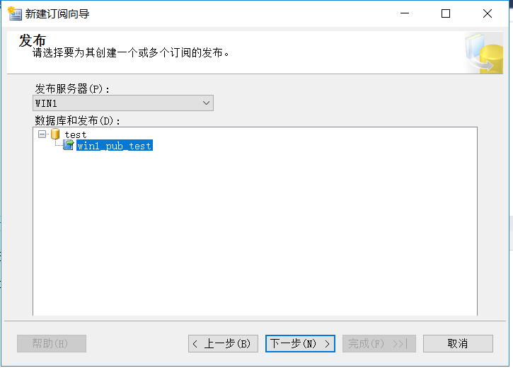

# Replication
可以用于：
- 报表
- 集成多个数据源数据
- 数据仓库
- 和手机用户交换数据

## Terminology 术语
| Componet           | Description                                                                                                                                                                                                      |
| :----------------- | :--------------------------------------------------------------------------------------------------------------------------------------------------------------------------------------------------------------- |
| Publisher          | 供其他数据库使用的，通常是主库                                                                                                                                                                                   |
| Subscriber         | 从publisher接收数据的，从库。可以有多个                                                                                                                                                                          |
| Distributor        | 存储replication元数据的，占用负载，应该和publisher在同一个实例                                                                                                                                                   |
| Article            | 要被replicated的对象，可以使用过滤减少数据量                                                                                                                                                                     |
| Publication        | 是要被replicated的对象的集合，作为一个单独的单元                                                                                                                                                                 |
| Subscription       | 是subscriber发送的接收publications的请求。它定义订阅者接收哪些发布。有两种类型的订阅：推送和拉取。在请求订阅模型中，负责移动数据的分发或合并代理在每个订阅服务器上运行。在推送模型中，分发或合并代理在分发服务器上运行。 |
| Replication Agents | 复制代理是位于 SQl 服务器外部的应用程序，用于执行各种任务。使用的代理取决于您实施的复制类型                                                                                                                      |

**a remote distributor:**和Publisher分离的
**a local distributor:**和Pulisher在一起的

## Types of Replication

### Snapshot
当同步发生时，snapshot replication 会做一个所有article的完全的拷贝。因此它不必跟踪更改的数据。如果设置过滤则只有过滤过的数据会被拷贝。
这意味着snapshot replication没有开销，但当开始同步时，如果数据量特别大，开销就会非常大。

Snapshot Agent会对每个在publication里的article创建系统试图和存储过程，通过这些对象生成article的内容。同时会创建schema文件，在它使用BCP批量加载数据到subscription前会把它应用到subscription。

#### 使用场景
受制于资源使用开销，Snapshot Replication最适合数据量小且数据变动不频繁的情况。

`此外Snapshot Replication被用来做Transaction 和Merge Replication初始化同步。`

#### 数据更新

当使用Snapshot Replication时，Snapshot Agent 运行在publisher去生成publication。Distributor Agent运行在distributor或每个subscriber。

此外Sanpshot Agent 仅单向工作，意味着subscriber不能更新publisher。
### Transaction
通过读在publisher的日志，然后把这些事务发送给subscribers。
运行在publisher的Log Reader Agent会读取这些日志，并且VLF是不会被截断的直到所有的事务被标记完成replication。所以如果同步之间有很长一段时间并且发生了许多数据修改，则存在事务日志增长甚至空间不足的风险。

从日志中读取事务后，分发代理会将事务应用于订阅服务器。此代理在推送订阅模型中的分发服务器运行，或在请求订阅模型中的每个订阅服务器上运行。同步由 SQL Server 代理作业计划，这些作业配置为运行复制代理，您可以配置同步，以便根据您的要求连续或定期进行同步。

初始化同步由Snapshot Agent执行。
#### 使用场景
服务器之间，在publisher有大量数据修改，且publisher和subscriber网络连接非常稳定可靠。

#### 数据更新
标准的Transaction Replication总是单向工作，意味着不能从subscriber更新publisher。

SQL Server也提供peer-to-peer的transaction replication。但是每台服务器扮演publisher和subscriber，这意味着更新会被应用到所有服务器。所以可能会发生数据冲突。

### Merge 
能够在publisher和subscriber同时update。

合并复制的工作原理是在作为publication中article的每个表上维护一个rowguid。如果这个表不存在有rowguid属性的uniqueidentifier列，merge replication会添加一个。当表中有数据修改时，一个触发器会触发，这个触发器会维护一系列变更跟踪的表。

当合并代理运行时，它仅应用行的最新版本。这意味着跟踪发生的更改的资源利用率很高，但权衡是合并复制实际同步更改的开销最低。
#### 应用场景
对于客户端-服务器方案（如移动销售人员），可以在其便携式计算机上输入订单，然后让它们与主销售数据库同步，这是一个不错的选择。它在某些服务器-服务器方案中也很有用，例如，通过 ETL 过程更新然后汇总到全局数据仓库的区域数据仓库。
#### 数据更新
能够在publisher和subscriber同时update。

由于订阅服务器和发布者都可以更新，因此存在行之间发生冲突的风险。您可以使用冲突解决程序来管理这些内容。合并复制提供了 12 个开箱即用的冲突解决程序，包括最早的胜利、最新的胜利和订阅者总是获胜。您还可以编写自己的基于 COM 的冲突解决程序，或选择手动解决冲突
### Peer-to-Peer 对等发布
对等发布支持多主复制。发布服务器将事务流式传输到拓扑中的所有对等方。所有对等节点可以读取和写入更改，且所有更改将传播到拓扑中的所有节点。
## 配置
### Distributor
**创建共享目录**
如果不配置共享目录就不能使用pull的方式订阅

**根据负载选择是否使用其他服务器作为分发服务器**

### Publisher

**根据需求选择发布的类型**

**表属性设置**
一些特别的属性需要设置，比如：
- 权限是否复制
- 索引是否复制
- 目标表已存在时的操作

**设置过滤行**

**也可以定时生成快照**

**安全设置**
snapshot agent权限：
- db_owner distribution
- 在共享目录上读写，修改的权限

logger reader agent权限：
- db_owner distribution
- 如果创建订阅时sync_type是Anything else: sysadmin on the distributor

### Subscriber

**Push or Pull**
根据负载决定

**分发代理安全性**
1. **push的订阅**
运行distribution agent账号权限：
   - distribution db_owner
   - Publication access list member
- 共享目录的读权限
连接到订阅的账号权限：
  - distribution db_owner
  - view server state 有多个订阅时需要
2. **pull的订阅**
运行distribution agent账号权限：
   - distribution db_owner
   - publisher access list member
   - 共享目录的读权限
   - view server state 有多个订阅时需要

**初始化订阅**
如果选择内存优化，则表会变成内存优化表，此时，subscriber端必须存在内存优化文件组

## 修改PAL Publication Access List
控制访问publication的
