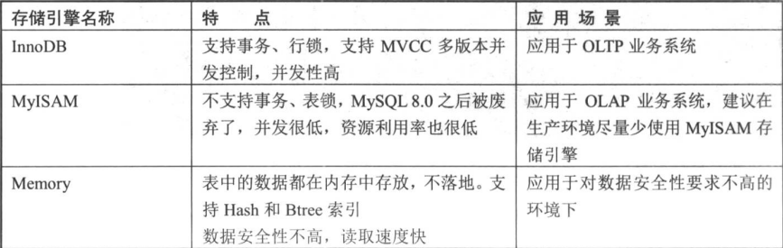
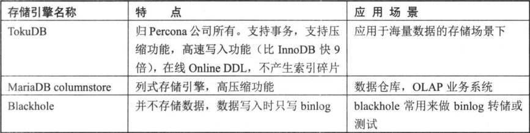
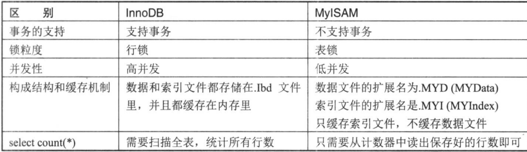
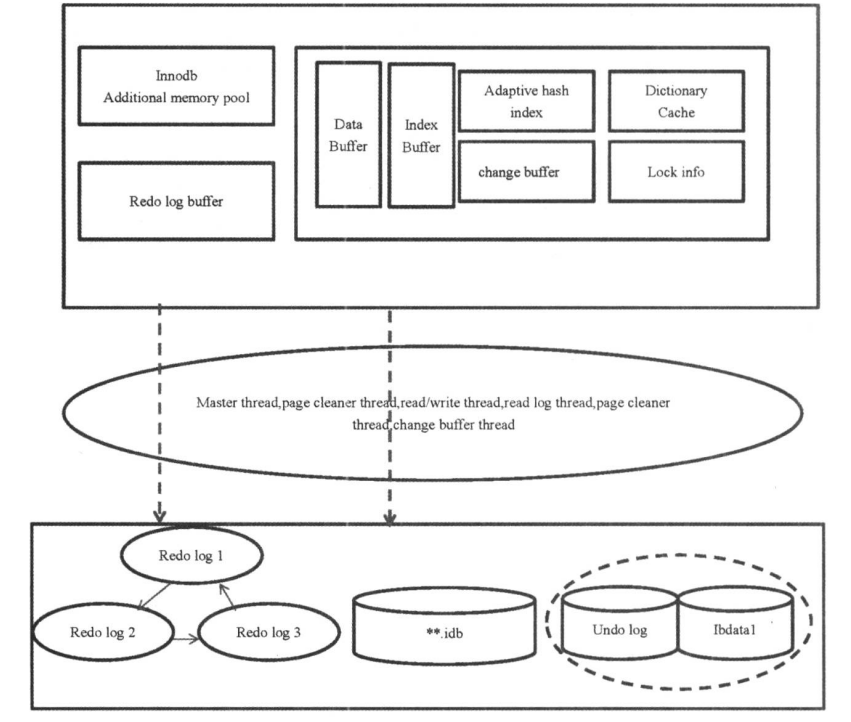
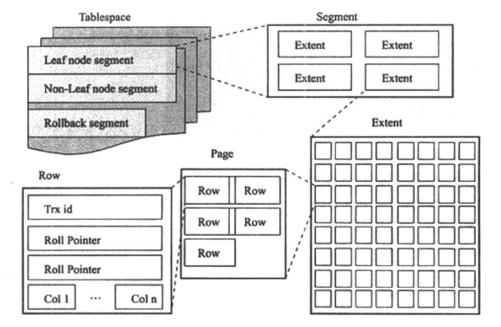

## 1.存储引擎


### 1.1.myisam和innodb对比

## 2.innodb体系结构(类比Oracle)
### 2.1.内存结构

### 2.2.存储结构

```
tablespace->segment->extent(1MB,64个page)->page(默认16k)

8.0开始已无.frm存储的表结构文件而是都存在系统表空间.
表空间:
系统/共享表空间(ibdata1):存储所有数据元数据信息和undo信息,默认自动扩展大小(innodb_autoextend_increment=64MB)
独立表空间:每个表有自己的表空间文件,innodb_file_per_table=on(是否为每个table使用单独的数据文件保存).

共享和独立区别:
独立:方便回收,迁移.有两个.frm(8.0已无)和.ibd文件描述符,表增长过快会出现性能问题
共享:无法在线回收,回收步骤:备份,删表,导入与原表结构一致的表

临时表空间:innodb_temp_data_file_path
通用表空间:多个表放同一表空间,根据活跃度存放在不同磁盘,减少存储开销

段:一个表一个段,有数据段,索引段,回滚段.由N个区和32个零散的页组成.通常,一个索引会创建两个段(叶子节点和非叶子节点)),而表则是索引的2倍
```
### 2.3.innodb内存结构
```
mysql> show variables like '%buffer%';
+-------------------------------------+----------------+
| Variable_name                       | Value          |
+-------------------------------------+----------------+
| bulk_insert_buffer_size             | 8388608        |
| innodb_buffer_pool_chunk_size       | 134217728      |
| innodb_buffer_pool_dump_at_shutdown | ON             |
| innodb_buffer_pool_dump_now         | OFF            |
| innodb_buffer_pool_dump_pct         | 25             |
| innodb_buffer_pool_filename         | ib_buffer_pool |
| innodb_buffer_pool_in_core_file     | ON             |
| innodb_buffer_pool_instances        | 1              |
| innodb_buffer_pool_load_abort       | OFF            |
| innodb_buffer_pool_load_at_startup  | ON             |
| innodb_buffer_pool_load_now         | OFF            |
| innodb_buffer_pool_size             | 134217728      |    8.0是动态的不需重启,缓存表的数据,索引,数据插入,数据字典等缓存
| innodb_change_buffer_max_size       | 25             |    插入缓冲占buffer pool最大比例
| innodb_change_buffering             | all            |    插入缓冲类型
| innodb_log_buffer_size              | 16777216       |    redo log buffer
| innodb_sort_buffer_size             | 1048576        |    innodb排序
| join_buffer_size                    | 262144         |    表连接使用
| key_buffer_size                     | 8388608        |    用于MYISAM引擎,只缓存其数据
| myisam_sort_buffer_size             | 8388608        |    MYISAM引擎排序缓存
| net_buffer_length                   | 16384          |
| preload_buffer_size                 | 32768          |
| read_buffer_size                    | 131072         |
| read_rnd_buffer_size                | 262144         |    随机读缓冲区,用于mrr(基于成本的查询)
| sort_buffer_size                    | 262144         |    sql在内存中排序  
| sql_buffer_result                   | OFF            |    sql结果集缓存
+-------------------------------------+----------------+
tmp_table_size:sql排序或分组没有使用索引,则使用临时表空间
max_heap_table_size:管理heap,memory存储引擎表
上面两个建议大小一致,且分配大些
 default_tmp_storage_engine:临时表存储引擎
internal_tmp_mem_storage_engine:内存中临时表的管理方式(该参数决定create temporary table)).5.7是在磁盘中(disk)
```
### 2.4.Buffer状态即其链表结构
```
page是磁盘I/O的最小单位,对应到内存则是一个个buffer.
buffer有如下状态:
1.free buffer:未被使用,像张白纸
2.clean buffer:内存中buffer数据和磁盘page数据一致
3.dirty buffer:内存中新写入数据,与磁盘中不一致,待写入磁盘
buffer在内存中是被组织起来的,由chain(链)管理.innodb是双向链表结构,由3种buffer状态组成3条链表.
1.free list:把free状态的buffer连接起来.在数据库运行过程中,如果在把page页内容调到内存中时,free buffer不够用,则会释放lru list和flush list中的buffer,得到新的free buffer.
2.lru list:把与磁盘数据一致,且最近最少被使用的buffer串联起来,释放出free buffer.
3.flush list:把dirty buffer串联起来,方便刷新线程把脏数据写入到磁盘.推进checkpoint Lsn,使实例崩溃后可以快速恢复.同时此链表也隐含lru规则(比如经常被更新的数据是暂时不会被链接管理的)
```
### 2.5 各大刷新线程及其作用
```
一.master thread:后台线程中的主线程,优先级最高.其内部有如下四个循环:
①.主循环loop:
主循环分每1秒操作和每10秒操作
a.每1秒:
1.日志缓冲刷新到磁盘,即使这个事务未提交
2.刷新脏页到磁盘
3.执行合并插入缓冲的操作
4.产生checkpoint
5.清除无用table cache
6.若无用户活动,就可能切换到background loop
b.每10秒:
1.日志缓冲刷新到磁盘,即使这个事务未提交
2.刷新脏页到磁盘
3.执行合并插入缓冲的操作
4.删除无用undo页
5.产生checkpoint

②.后台循环background loop
③.刷新循环flush loop
④.暂停循环suspend loop

二.四大I/O线程:默认都是4个,高转速磁盘可适当调大
read thread,write thread:数据库读写线程
redo log thread:把日志缓冲内容刷新到redo log
change buffer thread:把插入缓冲(change buffer)内容刷新到磁盘
三.page cleaner thread:刷新脏页到磁盘(参数innodb_page_cleaners)
四.purge thread:删除无用的undo.参数innodb_purge_threads,最大32个
五.checkpoint线程在redo log发生切换时,执行checkpoint.redo log发生切换或文件快写满时,会触发把脏页刷新到磁盘.确保redo log刷新到磁盘,实现持久化,避免数据丢失
六.error monitor thread:数据库报错监控
七.lock monitor thread:锁监控
```
### 2.6.内存刷新机制
**重要**:`redo log和bin log关系,以及数据写入机制,前滚,回滚的了解`
```
1.redo log:ib_logfile(0~N)命名,与Oracle一致,顺序写循环写.写满会切换并执行checkpoint,触发脏页的刷新.
a.innodb_flush_log_at_trx_commit参数值控制数据刷新到磁盘条件:
①.0:redo log thread每隔一秒刷新redo log buffer到redo log,同时进行刷盘操作,保证数据写入磁盘.但该参数每次事务提交不会触发redo log buffer数据刷新到redo log中
②.1:每次事务提交,触发redo log thread将日志缓冲中数据写入文件,并'flush'到磁盘.该模式保证在断电OS crash下不会丢失已提交数据.是最安全的模式.
③.2:每次事务提交,都把redo log buffer中数据写入redo文件,但不会同时刷新到磁盘
b.master thread:每秒进行刷新
c.redo log buffer:使用超过一半就会刷新

2.bin log:
DML语句数据既写入redo log,也写入bin log文件.是Mysql的二进制日志文件,用于备份恢复和主从复制.
binlog cache刷新到磁盘binlog文件条件:
sync_binlog参数:
①:0:事务提交后MySQL不做fsync之类的磁盘同步刷新指令刷新binlog_cache数据到磁盘,由Filesystem自行决定,或者cache满了才同步.
②:n:每进行n次事务提交之后,用类似fsync指令同步指令将数据写入磁盘

redo log和bin log区别:
1.记录内容:
redo是物理日志,记录所有innodb表数据变化
bin log是逻辑日志,记录所有数据的改变信息
2.记录内容时间不同:
redo记录事务发起后的DML和DDL SQL语句；
bin log记录事务commit完毕的DML和DDL SQL语句
3.文件使用方式:
redo循环使用
bin log不循环使用,写满或实例重启后生成新的bin log文件
4.作用不同:
redo log可作为异常宕机或介质故障后的数据恢复使用
bin log作为恢复数据和主从搭建

MySQL两阶段提交过程:
1.准备阶段(transaction prepare):SQL语句写入redo log buffer,并做一个准备标记,再将buffer中数据刷新到redo log中
2.提交阶段(commit):将事务产生的bin log写入文件,刷入磁盘.此时redo log中的标记写入成功.

前滚和回滚:buffer pool,redo log buffer,redo log,bin log,undo,datafile关系理解
三.脏页刷新条件
a.重做日志写满,在切换过程中执行checkpoint,会触发脏页刷新
b.innodb_max_dirty_pages_pct:脏页刷新所占百分比,达到设置就会刷新
c.innodb_adaptive_flushing:控制每秒刷新脏页数目,通过重做日志产生速度调整刷新脏页的最适合数量.即使未达到innodb_max_dirty_pages_pct设置值也会刷新一定数量的脏页,最多刷新100个脏页.
```
### 2.7.innodb三大特性
1.插入缓冲(change buffer)
```
把普通索引上的DML操作从随机IO变为顺序IO,提高IO效率.
原理:判断插入的普通索引页是否在缓冲池中,在就直接插入,不在则先放到change buffer中,然后将change buffer和普通索引合并到一个操作中,一下就提高普通索引插入性能.
参数:
| innodb_change_buffer_max_size | 25    |最大占innodb_buffer_pool大小
| innodb_change_buffering       | all   |类型
有如下类型:
a.all:inserts,delete-marking operations,and purges
b.none:关闭插入缓冲
c.inserts:
d.deletes:delete标记操作
e:changes:未进行实际insert和delete,只是标记,等待后续purges
f:purges:缓冲后台进程的purges操作(物理删除)
```
2.两次写(double write):
```
待添加
```
3.自适应哈希索引(adaptive hash index)
```
待添加
```