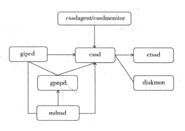
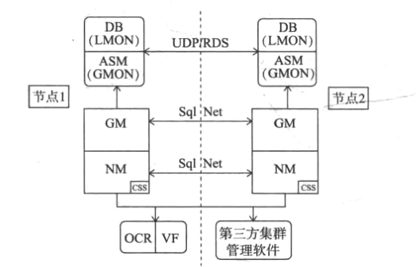
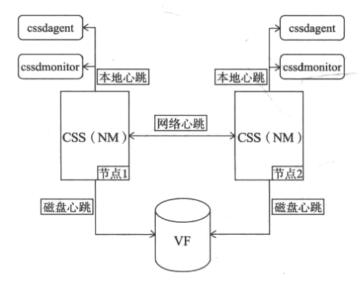
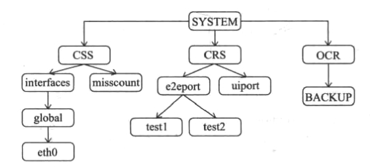

## OHAS(Oracle high availability services)
```
11gR2   
启动:/etc/inittab --> ohas.bin --> 代理进程(root/oracle/grid用户) --> ocssd.bin --> gpnpd.bin(集群基本信息)
资源管理:
ohas管理所有资源(包括其他守护进程和集群管理的资源),集群管理软件GI使用agent(代理进程)管理集群资源
CRSD(Cluster Ready Service Daemon):管理如下集群资源(crs_stat -t)
vip ora.[节点名].vip
ons ora.[节点名].ons(oracle notification service)
gns ora.[节点名].gns
asm实例 ora.ASM[节点编号].asm
监听程序 ora.[节点名].[监听程序名].lsnr
数据库 ora.[数据库].db
数据库服务 
数据库实例

代理进程(agent):管理资源如下
ora.asm:管理ASM实例
ora.cluster_interconnect.haip:集群HAIP管理
ora.crf:CHM(Cluster Health Monitor)管理
ora.crsd:管理集群其他资源,crsd.bin(cssd启动后)
ora.cssd,ora.cssdmonitor:集群的构建,并维护集群一致性,cssdmonitor监控cssd.bin
ora.ctssd:集群时间管理
ora.diskmon:集群exadata
ora.evmd:管理集群事件的发布,守护进程evmd.bin
ora.gipcd,ora.gpnpd,ora.mdnsd:负责集群bootstrap阶段

OCSS(Oracle Cluster Synchronization Service):负责构建集群并维护集群一致性

OCR(Oracle Cluster Registry):CRSD管理的集群资源注册表
OLR(Oracle Local Registry):保存本地集群注册表,用于ohasd守护进程提供集群的配置信息和初始化资源的定义信息
HAIP(High Availability IP):多个私网IP,用于节点网络心跳,内存融合间的实例通信

CHM:自动收集操作系统资源(CPU,内存,SWAP,进程,I/O,以及网络等)
组件:
    CHM档案库:grid_home/crs/db下
    系统监控服务(System Monitor Service):osysmond.bin
    集群日志服务(Cluster Logger Service):ologgerd
工作步骤:各节点osysmond通过集群私网向主节点ologgerd发送本节点操作系统统计信息,主节点ologgerd向CHM档案库写入统计信息同时发给父节点ologgerd,副节点通过ologgerd将统计信息写入CHM
访问工具:oclumon,CHMOSG(图形界面工具)
```
## 11gR2新增集群守护进程(agent管理的进程)
`代理进程管理进程的日志在$ORACLE_HOME/log/node1下对应目录内`

#### mdns(DNS)
        类DNS提供主机名到IP地址的解析服务,为集群gpnpd和ohasd守护进程提供资源发现(RD),帮助发现远程节点
#### gpnp(grid plug and play):gpnpd.bin
```
目的:保存集群的基本配置信息和与mdns通信灵活识别节点,而不需要完全依赖OCR

组成:
gpnp wallet(保存访问gpnp profile的客户签名信息,验证签名)

gpnp profile(保存GI启动(bootstrap)集群节点时必要信息,GI_HOME/gpnp/profiles/peer)

gpnptool

gpnpd:集群配置信息改变,实现集群信息同步

```
#### gipc(grid interprocess communication:集群心跳)

#### DiskMON:一体机

#### CTSS
`参照某一节点时间,如果节点NTP服务存在,则以观察模式运行,否则以活动模式修改系统时间`
#### cssdagent和cssdmonitor
```
监控守护进程ocssd,本地节点状态,以及节点观其终止本地节点
```
## CSS(Cluster Sysnchronization Service)

### CSS节点管理(NM)
#### ocssd启动顺序
```
ocssd.bin -> gpnpd(gpnp profile 通过vf得到基本配置) -->gpnpd(集群私网信息,以便和其他节点通信) -> gipcd(本地节点和远程节点私网信息) ->建立连接,集群重新配置 ->成功,集群成员列表更新
```
#### 集群心跳机制
```
集群一致性:每个成员了解其他成员状态,且获得其他节点状态和列表信息是一致的(Node Membership)
1.网络心跳:确保节点连通性
2.磁盘心跳:共享位置保存连通性信息,以便记录集群变化(节点数改变)到最新状态
3.本地心跳:自我监控,出现问题主动离开
```
   
`脑裂:集群节点间网络心跳丢失,但节点磁盘心跳正常`

#### 术语和参数简介
```
1.表决盘/表决文件(VF):保存每个节点磁盘心跳,以及每个节点看到的节点列表,脑裂时发生作用
    租借块(Lease Block):
    kill block:
2.Oracle集群注册表(OCR):11gR2记录集群CRSD相关信息
3.misscount:集群网络/本地心跳超时时间(default 30s)
4.LIOT(long I/O timeout):节点进行磁盘心跳时对VF的IO超时时间(200s)
5.SIOT(short IO timeout):节点重新配置时对VF的IO超时时间(misscount(30)-reboottime(3))
6.重新配置主节点(Reconfiguration master):Node Membership节点数量发生变化,某一结点承担重新配置(发送重配消息,接收反馈,对OCR，VF修改等)
7.reboot time:集群要求OS重启的时间(3s)
8.diagwait
9.Incarnation
```
#### CSS组管理(GM)
**共享和隔离**:
```
组(全局组,本地组):一组成员和他们资源组成的整体
成员:独立运行的是实体(如OS进程)
GM master:负责组成员的重新配置
```
## CRS(Cluster Ready Service:集群就绪服务)
`管理集群中的应用程序(或者说是其资源),以及OCR(更新和备份)`
```
1.基本概念

2.OCR
ocrdump工具看出特点:
    逻辑结构:见下图
    主要三部分内容:
        SYSTEM:CSS,CRS,EVM重要配置信息
        DATABASE:集群定义的资源一部分配置信息.被srvctl,vipca,dbca,netca等工具使用
    OCR是会被备份的:ocrconfig工具
    键值组成:名称,ORATEXT(值),SECURITY(安全属性)

OCR管理:
ocrcheck 工具 检查
ocrconfig 恢复:
    ocrconfig -showbackup
    所有节点停止集群:crsctl stop crs(已在root环境变量添加路径)
    恢复:ocrconifg -restore file_loc

crsd.bin守护进程(11gR2):
由于10gR2资源管理不完善所以推出了新的资源管理架构-agent,除ohasd,其他一切守护进程和资源都被称之为资源.
agent基本概念:
EP(Entry Point):指定agent可对资源执行哪些操作
    动作:start,stop,check,clean,abort
    状态(资源进入EP后返回):online,offline,unknown,partial(部分在线),failed(agent会clean EP,之后工具资源选择failover或restart),intermediate(一个状态到另一个状态之间的中间状态)
agent(代理进程):只能被ohasd或crsd启动(且agent是高可用多线程的进程,有不同用户启动)
    ohasd启动的:管理集群的初始化资源
    crsd启动的:管理集群的应用程序资源
    ps -ef | grep agent

PE(Policy Engine):协调集群资源管理,保证操作顺序执行(主节点),由以下模块协调进行:
    PE模块,agent模块,UI(user interface)模块,OCR模块,通告模块,通信模块

资源类型,资源属性,资源依赖关系

CRSD管理的新资源(本地和集群)
    本地资源只能在本节点上运行,不能转移到集群其他节点运行
    集群资源:选择在集群某一节点运行,某个节点出现问题资源可以切换到其他节点
```
通过ocrdump工具导出文件可以看出的OCR的逻辑结构    


