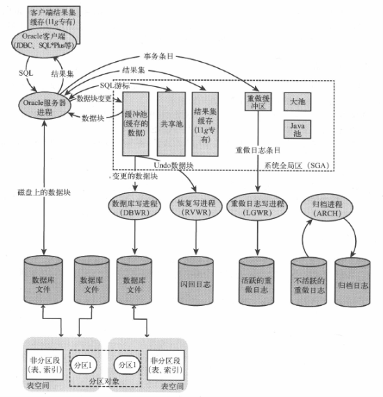

# 2.1 SQL语句处理过程简述
1.创建游标  
```
    游标(上下文区域)是内存中一块区域,保存SQL语句相关的信息(包括已解析和未解析的内容,执行计划以及一个指向当前记录的指针).SQL执行完成后,释放相关内存,也可以被保存再次使用.
```
2.检查缓存的SQL
```
    避免不必要的解析,保存最近执行的SQL和对应的执行计划,即共享池(shared pool中library cache)
```
3.解析SQL
+ 检查SQL语法
+ 检查语义(对象是否有效)
+ 检查对象权限
+ 确定执行计划 

4.关联绑定变量  
5.执行SQL   
6.提取记录  
7.使用批量提取  
8.处理结果集    
9.关闭游标
# 2.2
## 2.2.1 基于成本的优化(CBO)
## 2.2.2 优化器目标
```
参数optimizer goal(optimizer_mode)
all_rows cbo处理SQL返回所有记录的最小成本(默认配置,适合报表)
first_rows_n  cbo选择最小化提取前n条记录的成本的执行计划(适合交互性应用程序)
```
## 2.2.3 优化器统计信息
`深入理解表中数据,包括数据规模和数据分布情况.`
+ 关于表的记录数,已经使用的块和空闲块的数量,行的平均长度,以及每个块内已使用的空间的平均占用比例
+ 关于列的不同值的数量,最大值与最小值,以及列的选择性
+可选统计选项,直方图:记录单列的值的分布状况.有些列值出现多,有些列值出现少,Oracle利用直方图信息决定是否根据查询条件使用索引
## 2.2.4 绑定变量窥视与自适应游标共享
>&emsp;&emsp;**引入原因**:直方图与绑定变量的冲突.直方图需要知道变量值,而绑定变量会隐藏值    
>&emsp;&emsp;**绑定变量窥视**:生成执行计划前,Oracle会窥视第一个绑定变量值.(有第一个值确定了执行计划,有可能使用了索引,也有可能全表扫描)  
>&emsp;&emsp;**自适应游标共享**:当绑定变量的不同值适合不同的执行计划处理时,Oracle会为一个SQL生成多个不同的执行计划
## 2.2.5 提示(hint)
>&emsp;&emsp;出现在SQL语句的第一个单词后面(select,insert,update等),详见第八章.
## 2.2.6 存储概要,SQL概要和SQL计划基线
>&emsp;&emsp;**存储提纲**:指示一个已经上线的系统的SQL执行计划   
>&emsp;&emsp;**SQL剖析**:包含SQL语句执行的附加统计信息  
>&emsp;&emsp;**SQL计划基线**:保存SQL语句的执行计划和执行统计信息.生成新的执行计划时,Oracle将此计划与SQL基线进行比较,当新计划更高效时才使其生效
# 2.3 事务和锁
# 2.4 Oracle服务器体系结构

## 2.4.1 实例与数据库
**实例**:`共享内存区域和后台进程组成`
## 2.4.2 系统全局区(sga)
## 2.4.3 数据缓存
+ 客户端结果集缓存
+ 服务端结果集缓存
+ 缓冲池
## 2.4.4 程序全局区(pga)
## 2.4.5 内存管理
# 2.5 段与文件
`段是各类数据的容器`
## 2.5.1 表
`数据存储的基本单元,与关系模型中的实体相对应.`
+ 堆表(heap),默认类型
+ 散列聚簇表
+ 索引组织表
+ 索引聚簇
+ 对象表
+ 嵌套表
+ 外部表
+ 临时表
## 2.5.2 索引
+ b*tree索引
+ 位图索引
+ 函数索引
+ 虚拟索引
## 2.5.3 块,区间,段以及分区
```
    段-->区间-->块     
    表与索引都是由区间(extent)的独立存储单元组成.区间则由块这一存储单元组成,块大小一般在8KB到32KB之间.
    对于非分区的表与索引来说,区间是单一段(segment)的一部分.分区表或索引则是由多个段组成,每个段表示一个分区(partition).单表与索引中有LOB,嵌套表或索引组织表时,也可以由多个段组成.
```
## 2.5.4 表空间与数据文件
```
    表空间-->数据文件
    段属于特定的表空间,该表空间定义段的存储特性(如块大小).表空间由多个数据文件组成(操作系统文件,裸磁盘分区或asm文件)
```
## 2.5.5 回滚段
## 2.5.6 重做日志与归档日志
## 2.5.7 闪回日志
# 2.6 服务器进程
+ 独占服务器进程
+ 共享服务器进程
+ 并行查询服务器进程
+ 任务与调度服务器进程
# 2.7 后台进程
+ 监听进程
+ 数据库写进程(DBWR)
+ 日志写进程(LGWR)
+ 日志归档进程(ARCH)
+ 恢复写进程(RVWR)
# 2.8 真正应用群集(RAC)
