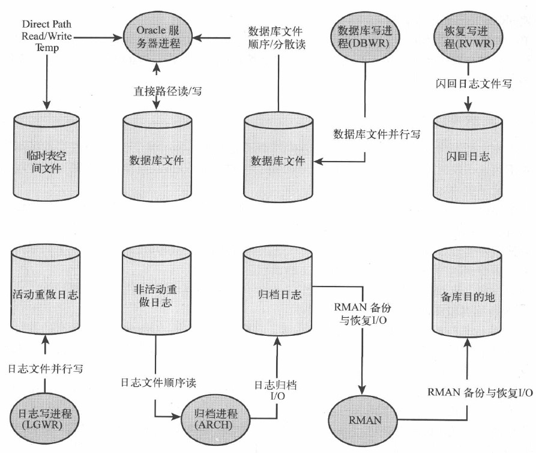

# 21.1 磁盘IO概念
## 21.1.1 服务时间(延时)和吞吐量
&emsp;&emsp;**服务时间**:从磁盘设备获取信息的单个条目消耗的时间.对于一个自旋设备,包括转动磁盘片到正确位置(旋转延时),移动读写磁头到位(寻址时间),磁盘传输数据到服务器(传输延时) .  
&emsp;&emsp;**吞吐量**:给定时间内能够完成的io数.就执行随机读单个磁盘设备,吞吐量由寻道时间和旋转延时决定. 通常表达每秒的io操作次数(IOPS).   
&emsp;&emsp;**io带宽**:io操作的类型(随机或连续)服务时间和磁盘数的函数.
## 21.1.2 排队
&emsp;&emsp;磁盘控制器使用磁头移动算法,按照顺序把需要的服务请求排队最小化读/写磁头的移动.
## 21.1.3 磁盘驱动器:慢和正在变得更慢
## 21.1.4 磁盘容量和数据分布
# 21.2 Oracle IO架构

## 21.2.1 数据文件单块读
&emsp;&emsp;db file sequential read
## 21.2.2 多块读
&emsp;&emsp; db file scattered read
## 21.2.3 直接路径读
+ 临时段io
+ 并行
## 21.2.4 临时直接路径IO
&emsp;&emsp;direct path read temp和direct path write temp
## 21.2.5 数据文件写IO
&emsp;&emsp;DBWR IO被记作数据库文件并行写(db file parallel write)
## 21.2.6 直接路径写
&emsp;&emsp;direct path write
## 21.2.7 重做日志IO
&emsp;&emsp;log file parallel write
## 21.2.8 归档日志IO
&emsp;&emsp;Log archiveI/O
## 21.2.9 闪回IO
&emsp;&emsp;flashback log file writes
## 21.2.10 控制文件IO
# 21.3 度量和监控Oracle IO
## 21.3.1 IO等待次数
```
v$system_event  等待接口
v$sys_time_model
v$iostat_file
v$iostat_function
```
## 21.3.2 监控数据文件IO
```
v$tempstat
v$filestat
dba_temp_files
dba_data_files
```
## 21.3.3 IO基准测试
&emsp;&emsp;Oracle提供dbms_resource_manager.calibrate_io测试磁盘io能力.要启用异步IO,且要在数据库空闲时运行job.      
&emsp;&emsp;视图dba_rsrc_io_calibrate保存结果
# 21.4 优化数据文件IO
## 21.4.1 最小化IO延时
+ 保持磁盘设备稀疏,推荐50%
+ 不要使磁盘过载,保持磁盘最大吞吐量50%~70%
## 21.4.2 最大化IO吞吐量
&emsp;&emsp;增加磁盘卷的物理磁盘数量
## 21.4.3 条带化策略
&emsp;&emsp;**条带化**:条带（strip）是把连续的数据分割成相同大小的数据块，把每段数据分别写入到阵列中的不同磁盘上的方法。简单的说，条带是一种将多个磁盘驱动器合并为一个卷的方法。 许多情况下，这是通过硬件控制器来完成的。
+ 硬件条带化
+ 软件条带化
+ Oracle自动存储管理
+ 人工条带化把数据分布到各个磁盘(差)
## 21.4.4 RAID阵列
&emsp;&emsp;**推荐RAID 10或RAID 01**
+ RAID 0(磁盘条带化)
&emsp;&emsp;逻辑磁盘由多个物理磁盘组成,数据均匀分散.但无冗余,磁盘文件损坏只能从备份恢复.
+ RAID 1(磁盘镜像)
&emsp;&emsp;逻辑磁盘由两个物理磁盘组成.一个磁盘失败可以使用另一个磁盘.每个磁盘包含一致的数据写(并行).读吞吐量提高.
+ RAID 5
&emsp;&emsp;逻辑磁盘由多块物理磁盘组成.数据用磁盘条带化相似的方法安排在多个物理设备.但物理设备有一定比例的数据是奇偶校验数据(包含来自其他磁盘设备数据信息,防止物理设备损坏)     

1.RAID 5写缺陷  
&emsp;&emsp;写的时候要读取源块和奇偶校验块再更新.当有一个磁盘失败时,必须要访问所有磁盘重建失败磁盘的逻辑视图.

2.RAID 5设备中的非易失性缓存    
&emsp;&emsp;一种具有电池备份的内部存储,确保缓存中数据即使发生电力失败时也不会丢失.数据被缓存了就可以认为写入磁盘.
## 21.4.5 隔离数据文件IO
&emsp;&emsp;优先隔离重做和归档日志,特定表空间(临时表空间).所以要确保可预测响应时间,比如突发性的大量日志归档,而数据文件则遇到高频度的大量事务.
# 21.5 重做和归档优化
## 21.5.1 交替和分发日志
&emsp;&emsp;将重做日志和归档日志文件分别放到一个单独的卷上.     
&emsp;&emsp;因为LGWR在一个设备顺序写,而ARCH在另外一个设备顺序读,每个设备都对自己的日志拥有独占访问.
## 21.5.2 重做和归档设备的细粒度条带化
## 21.5.3 对重做日志使用RAID　5说no
## 21.5.4 重做日志大小
非io相关的重做日志等待:
+ 切换到一个新的重做日志
+ 数据库归档,且要被重用的日志还没被归档
+ 日志重用前,数据要被写入到合适的磁盘
大小根据事务速率配置,通常是512MB~1GB,数量10~20个也正常.
# 21.6 闪回日志


