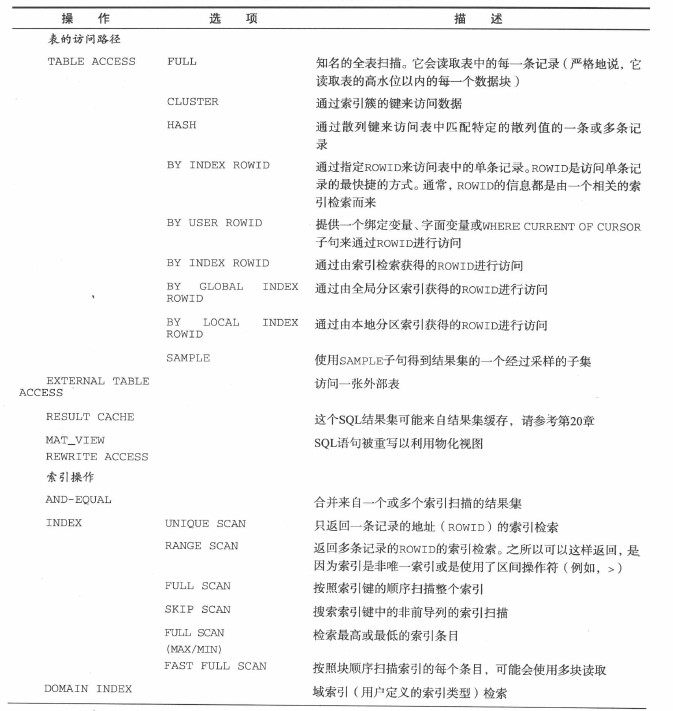
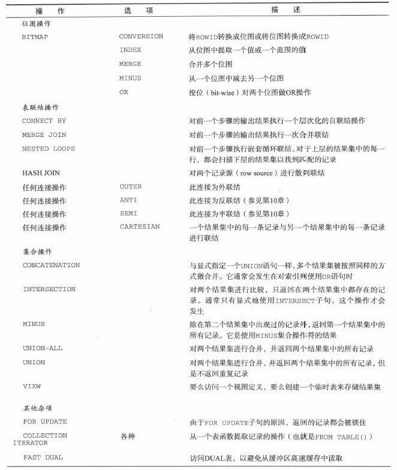
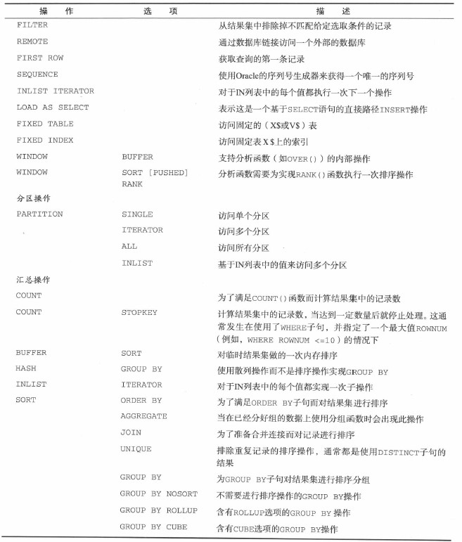
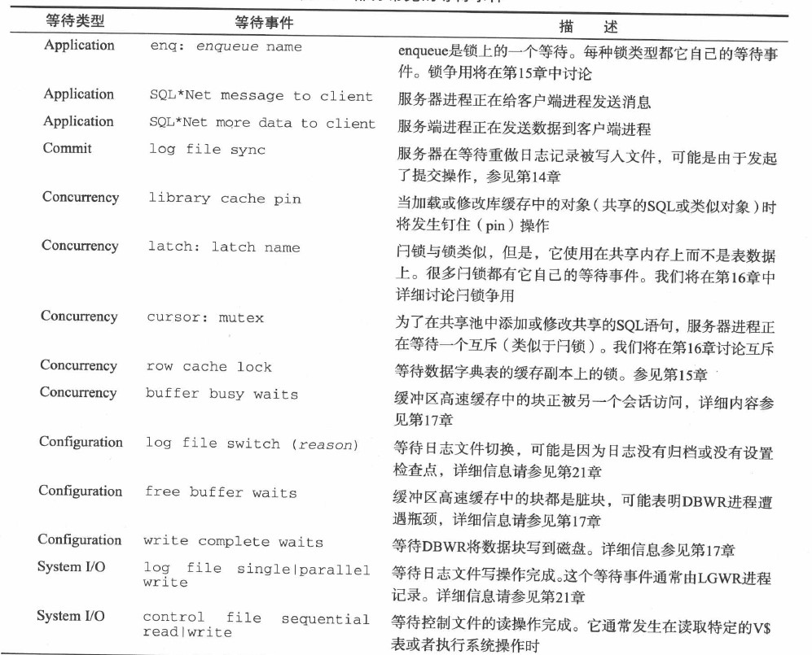
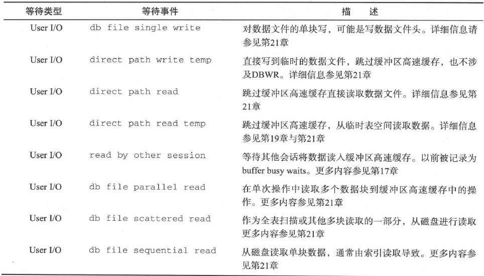

# 3.1 生成SQL语句执行计划
```sql
explain plan
    [set statement_id = 'statement_id']
    [into table_name]
    for sql_statement;
--explain plan 命令将执行计划插入计划表
--statement_id SQL语句唯一标识符
--table_name   存储执行计划的计划表名称,表结构要与默认表plan_table一致 
```
## 3.1.1 计划表
&emsp;&emsp;默认插入plan_table,可以使用脚本utlplan.sql创建自己的计划表($ORACLE_HOME/rdbms/admin下).Oracle有一个全局临时plan_table供所有用户使用.
**计划表各列说明**
```
statement_id    子句提供的SQL唯一标识符
plan_id         全局表唯一标识符
timestamp       语句执行的日期时间
remarks         注释
id              每一步的唯一标识符
parent_id       父步骤的标识
position        两个步骤有同一父步骤,更低的position值优先执行
operation       执行操作类型,如table acess或sort等
options         操作的附加信息,如table scan可能是full或by rowid
object_node     如果是分布式查询,表示引用对象的数据库链接.对并行查询,对应临时结果集
object_owner    对象所有者
object_name     对象名称
object_instance 对象在SQL中位置
object_type     对象类型(表,索引等)
optimizer       优化器目标
search_columns  未使用
other           分布式查询:包含发往远程数据库的SQL语句文本.并行查询:并行从属性进程执行的SQL语句
other_xml       包含XML文档中的其他附加信息.版本信息,SQL概要或存储概要,动态采样,执行计划散列值
other_tag       标识other列值的类型,分布式或并行
cost            估算的相对成本
cardinality     基数,预估这一步返回的记录数
bytes           预估这一步返回的字节数
partition_start 要执行分布式消除(partition elimination),则表明要访问分区的起始分区.可能包含关键字key或row location,来表明要访问的分区将在运行时确定
partition_end   将要访问分区的结束分区
distribution    描述记录如何从并行查询从属进程(生产者)分配到后续的"消费者"从属进程.值可能是partition(rowid),partition(key),hash,range,round-robin,broadcast(order),QC(random)的
cpu_cost        估算cpu成本
io_cost         估算IO成本
temp_space      估算这一步临时存储段的空间大小
access_predicates SQL中确定如何提取记录的子句
filter_predicates sql中确定过滤记录的子句
projection      决定将返回记录的子句,即排序,选取等处理的列
time            这一步骤估算的时间消耗
qblock_name     查询块的唯一标识符,qb_name可指定
```
**获取执行计划信息**:
```sql
explain plan for select * from scott.emp;
--第一种,直接从plan_tale读取
select * from plan_table;
--第二种,使用dbms_xplan包
select * from table(dbms_xplan.display());
```
## 3.1.2 研究缓存的SQL
```
v$sql
缓存的SQL信息
v$sql_plan
缓存的SQL执行计划
v$sql_plan_statistics
缓存的计划中每个步骤的执行次数,io次数,处理的记录数
```
## 3.1.3 DBMS_XPLAN
**调用DBMS_XPLAN基本语法**
```sql
select * from table(dbms_xplan.function());
--常用的两个dbms_xplan函数
SQL> desc dbms_xplan.display
Parameter    Type                  Mode Default? 
------------ --------------------- ---- -------- 
(RESULT)     DBMS_XPLAN_TYPE_TABLE               
TABLE_NAME   VARCHAR2              IN   Y        
STATEMENT_ID VARCHAR2              IN   Y        
FORMAT       VARCHAR2              IN   Y        
FILTER_PREDS VARCHAR2              IN   Y        
/* display函数展示plan_table中的执行计划
    format      控制输出格式的关键字,包含高级关键字basic,typical(默认)和all,还有其他对输出进行微调的关键字.执行计划觉得信息相关才展示相关的列
    filter_preds    允许针对执行计划表的查询语句的where子句添加限定条件,默认null

    typical     默认输出设置.
    basic       只展示执行计划
    all         展示所有信息
    各高级关键字元素可以通过在限定词前加加号(+)或减号(-)表明是否包含此项
    bytes       估算步骤的字节数
    cost        估算步骤优化器成本
    partition   与分区消除和修剪相关信息
    parallel    并行处理信息
    predicate   谓词信息(表连接与where子句过滤的信息)   
    projecttion 投影信息,包括排序选取以及相关操作中处理的列
    alias       显示查询块的别名
    remote      显示远程SQL
    note        杂项信息
    iostats     与缓存的SQL执行计划有关的io统计信息,只有当statistics_level=all或有gather_plan_stats提示才展示
    memstats    显示排序和散列连接活动中内存和磁盘使用信息
    allstats    等同于+iostats+memstats
    last        显示最近一次执行时缓存的执行计划统计信息

*/
SQL> explain plan for select * from scott.dept d join scott.emp e using(deptno) order by e.empno;

Explained

SQL> select * from table(dbms_xplan.display(null,null,'typical -bytes',null));
--注意空格分隔限定词
PLAN_TABLE_OUTPUT
--------------------------------------------------------------------------------
Plan hash value: 1736908262
--------------------------------------------------------------------------------
| Id  | Operation                     | Name    | Rows  | Cost (%CPU)| Time
--------------------------------------------------------------------------------
|   0 | SELECT STATEMENT              |         |    14 |     7  (29)| 00:00:01
|   1 |  SORT ORDER BY                |         |    14 |     7  (29)| 00:00:01
|   2 |   MERGE JOIN                  |         |    14 |     6  (17)| 00:00:01
|   3 |    TABLE ACCESS BY INDEX ROWID| DEPT    |     4 |     2   (0)| 00:00:01
|   4 |     INDEX FULL SCAN           | PK_DEPT |     4 |     1   (0)| 00:00:01
|*  5 |    SORT JOIN                  |         |    14 |     4  (25)| 00:00:01
|   6 |     TABLE ACCESS FULL         | EMP     |    14 |     3   (0)| 00:00:01
--------------------------------------------------------------------------------
Predicate Information (identified by operation id):
---------------------------------------------------
   5 - access("D"."DEPTNO"="E"."DEPTNO")
       filter("D"."DEPTNO"="E"."DEPTNO")

19 rows selected
/*  
    根据format不同,展示的执行计划列有所不同.结果字段描述:
    operation       这一步执行的操作
    name            这一步处理的对象
    rows            预期这一步处理的记录数
    bytes           预期这一步处理的字节数
    cost(%CPU)      总的优化器成本以及成本消耗的cpu使用比率
    time            估算这一步消耗时间
    TmpSpc          估算这个操作耗费的临时空间.排序或散列造成的
    TQ              对于并行执行操作,展示表的排队信息,解释操作涉及了那些数据流以及并行处理次序,见13章
    IN-OUT          对于并行执行操作,标识并行到并行(P-P),并行到串行(P-S),并行与父进程合并(PCWP),并行与子进程合并(PCWC)或串行到并行(S-P)
    PQ Distrib      描述并行执行本质,通常用于协调器活动
    Starts          IOSTATS选项,启动这个步骤次数
    E-Rows          IOSTATS选项,估算将由这一步处理的记录数(estimate rows)  
    A-Rows          IOSTATS选项,这一步实际处理的记录数(actual rows)
    Buffers         IOSTATS选项,这一步逻辑读次数
    Reads           IOSTATS选项,这一步物理读次数
    OMem            MEMSTATS选项,估算这一步操作的最优内存大小,最优大小是保证此操作完全在内存进行
    1Mem            MEMSTATS选项,估算出此操作只需处理一次临时段所需要的内存大小
    O/1/M           最优执行,一路交互执行,多路交互执行分别对应的次数,记录这个操作必须进行的临时段IO次数,以及此IO处理是一次交互还是多次交互
    Pstart          分区操作选项,处理的最小分区好
    Pstop           分区操作选项,处理的最大分区号

*/


SQL> desc dbms_xplan.display_cursor
Parameter       Type                  Mode Default? 
--------------- --------------------- ---- -------- 
(RESULT)        DBMS_XPLAN_TYPE_TABLE               
SQL_ID          VARCHAR2              IN   Y        
CURSOR_CHILD_NO NUMBER                IN   Y        
FORMAT          VARCHAR2              IN   Y  
--display_cursor展示v$sql_plan中缓存的执行计划信息      
```
## 3.1.4 解释执行计划
+ 缩进越多访问路径越先被执行
+ 缩进同样多的级别步骤,先执行最上面的那条语句
```sql
SQL> explain plan for select * from sh.sales s join sh.customers c using(cust_id) order by cust_id;

Explained


SQL> select * from table(dbms_xplan.display());

PLAN_TABLE_OUTPUT
--------------------------------------------------------------------------------
Plan hash value: 2097620020
--------------------------------------------------------------------------------
| Id  | Operation             | Name      | Rows  | Bytes |TempSpc| Cost (%CPU)|
--------------------------------------------------------------------------------
|   0 | SELECT STATEMENT      |           |   918K|   184M|       | 10446   (1)|
|   1 |  MERGE JOIN           |           |   918K|   184M|       | 10446   (1)|
|   2 |   SORT JOIN           |           | 55500 |  9810K|    24M|  2609   (1)|
|   3 |    TABLE ACCESS FULL  | CUSTOMERS | 55500 |  9810K|       |   405   (1)|
|*  4 |   SORT JOIN           |           |   918K|    25M|    84M|  7836   (1)|
|   5 |    PARTITION RANGE ALL|           |   918K|    25M|       |   525   (2)|
|   6 |     TABLE ACCESS FULL | SALES     |   918K|    25M|       |   525   (2)|
--------------------------------------------------------------------------------
Predicate Information (identified by operation id):
---------------------------------------------------
   4 - access("S"."CUST_ID"="C"."CUST_ID")
       filter("S"."CUST_ID"="C"."CUST_ID")

19 rows selected
```
**常见执行计划步骤**:



##　3.1.5 虚拟索引
&emsp;&emsp;没有创建对应物理实体的索引.     
&emsp;&emsp;目的:在不必耗时,耗cpu,耗IO以及消耗大量存储去创建实际索引,判断一个索引对SQL优化是否起作用.
```sql
alter session set "_use_nosegment_indexs"=true;
create index sh.sales_vil on sh.sales(quantity_sold) nosegement;
```
# 3.2 跟踪Oracle执行计划
&emsp;&emsp;跟踪执行计划可以提供与explain plan与dbms_xplan能提供的所有信息,且更加准确.同时集中于整个事务的优化,而不是单个SQL语句.   

**SQL跟踪组成**:
+ SQL跟踪
+ Tkprof工具
## 3.2.1 在当前会话启用跟踪
```sql
alter session set sql_trace=true;

/* 
包含基本的跟踪,SQL语句的执行统计信息和执行计划,但不包含绑定变量的值与
等待事件花费的时间.更高级的跟踪可以使用dbms_session包.
*/
SQL> desc dbms_session.session_trace_enable
Parameter Type     Mode Default? 
--------- -------- ---- -------- 
WAITS     BOOLEAN  IN   Y        
BINDS     BOOLEAN  IN   Y        
PLAN_STAT VARCHAR2 IN   Y
waits           true收集等待信息,false反之
binds           true收集绑定变量信息,false反之
plan_stat       11g专有,确定何时收集执行计划的每一步记录数.never,first_execuptions或all_execuptions

exec DBMS_SESSION.SESSION_TRACE_DISABLE;
--关闭跟踪
```
## 3.2.2 识别跟踪文件
```sql
alter session set tracefile_identifier=COMPANY;
--为会话指定一个跟踪文件标识符
```
## 3.2.3 获取跟踪状态
&emsp;&emsp;在v$session中,sql_trace,sql_trace_waits与sql_trace_binfs展示了一个会话的跟踪状态.   
&emsp;&emsp;在v$process中,列traceid与tracefile(11g)展示跟踪文件名称
```sql
select s.sql_trace,
       s.sql_trace_waits,
       s.sql_trace_binds,
       p.traceid,
       p.tracefile
  from v$session s
  join v$process p
    on p.addr = s.paddr
 where audsid = userenv('sessionid')
```
## 3.2.4 在其他会话调用跟踪
```sql
SQL> desc dbms_monitor.session_trace_enable
Parameter  Type           Mode Default? 
---------- -------------- ---- -------- 
SESSION_ID BINARY_INTEGER IN   Y        
SERIAL_NUM BINARY_INTEGER IN   Y        
WAITS      BOOLEAN        IN   Y        
BINDS      BOOLEAN        IN   Y        
PLAN_STAT  VARCHAR2       IN   Y

--session_id与serial_num对应视图v$session中sid与serial#
```
## 3.2.5 通过module,action,service进行跟踪
```sql
SQL> desc dbms_monitor.serv_mod_act_trace_enable
Parameter     Type     Mode Default? 
------------- -------- ---- -------- 
SERVICE_NAME  VARCHAR2 IN            
MODULE_NAME   VARCHAR2 IN   Y        
ACTION_NAME   VARCHAR2 IN   Y        
WAITS         BOOLEAN  IN   Y        
BINDS         BOOLEAN  IN   Y        
INSTANCE_NAME VARCHAR2 IN   Y        
PLAN_STAT     VARCHAR2 IN   Y 
--可以从v$session中找到service_name,module_name,action_name属性列,从而找到会话属于哪个应用
```
## 3.2.6 使用登录触发器启用跟踪
```sql
create or replace trigger trace_login_trigger
  after logon on database
begin
  if user = ' GUY' then
    execute immedate ' alter session set tracefile_identifier=GUY';
    dbms_session. session_trace_enable(waits     => true,
                                       binds     => false,
                                       plan_stat => ' all_executions');
  end if;
end;
```
## 3.2.7 定位跟踪文件
&emsp;&emsp;跟踪文件被写到user_dump_dest位置.       
&emsp;&emsp;跟踪文件名字为Sid_procId_pid[_traceId].trc
```sql
SQL> show parameter user_dump_dest;
```
&emsp;&emsp;找到跟踪文件
+ 检查时间戳
+ 搜索特定SQL语句
+ 让程序告诉你.如v$process中tracefile列
+ tracefile_identifier标识
## 3.2.8 其他特殊化跟踪
+ dbms_profile包跟踪pl/sql包代码,见12章
+ alter session set events命令
# 3.3 使用tkprof格式化跟踪文件
&emsp;&emsp;tkprof回车即可看到帮助
&emsp;&emsp;**sort排序选项**
&emsp;&emsp;多个选项组合到一起,可能导致语句按照指定的选项总和排序,如prsdsk,exedsk,fchdsk.如下组合是无效的:  
+ mis只能应用到prs
+ row只能应用到exe或fch
## 3.3.1 合并多个SQL跟踪文件
+ 生成一个会话的tkprof,但这个会话是由共享服务器连接的
+ 根据多个会话生成一份tkprof
+ 报个一个特定的模块,动作或服务的相关信息,但这些信息分布在多个跟踪文件中
&emsp;&emsp;trcsess工具则可以接收来自多个跟踪文件的输入,应用各种过滤条件,并将匹配的结果输出到一个跟踪文件,然后用tkprof处理.
## 3.3.2 解释tkprof的输出结果
+ 块读取与获取的记录数比率,访问的内存块越多,记录越昂贵
+ 解析次数与执行次数比率,理想解析应接近1,比率越高则表明在执行无用的重解析
+ 提取的记录数与提取次数比率
+ 磁盘读取与逻辑读取,缓冲命中率
## 3.3.3 tkprof中的执行计划
&emsp;&emsp;Row Source Operation是实际使用的执行计划,explain plan则是在指定explain选项后生成的.
```sql
Trace file: orcl_ora_3372_NEW.trc
Sort options: fchqry  prsqry  exeqry  
********************************************************************************
count    = number of times OCI procedure was executed
cpu      = cpu time in seconds executing 
elapsed  = elapsed time in seconds executing
disk     = number of physical reads of buffers from disk
query    = number of buffers gotten for consistent read
current  = number of buffers gotten in current mode (usually for update)
rows     = number of rows processed by the fetch or execute call
********************************************************************************

SQL ID: 09wq61kxt1c3h Plan Hash: 4109827725

select cust_id,sum(amount_sold),avg(amount_sold) 
from
 sales group by cust_id order by 1


call     count       cpu    elapsed       disk      query    current        rows
------- ------  -------- ---------- ---------- ---------- ----------  ----------
Parse        1      0.01       0.04          0          0          0           0
Execute      1      0.00       0.00          0          0          0           0
Fetch      472      0.45       0.46       1619       1635          0        7059
------- ------  -------- ---------- ---------- ---------- ----------  ----------
total      474      0.47       0.51       1619       1635          0        7059

Misses in library cache during parse: 1
Optimizer mode: ALL_ROWS
Parsing user id: 87  (SH)
Number of plan statistics captured: 1

Rows (1st) Rows (avg) Rows (max)  Row Source Operation
---------- ---------- ----------  ---------------------------------------------------
      7059       7059       7059  SORT GROUP BY (cr=1635 pr=1619 pw=0 time=464975 us cost=1850 size=70590 card=7059)
    918843     918843     918843   PARTITION RANGE ALL PARTITION: 1 28 (cr=1635 pr=1619 pw=0 time=164305 us cost=525 size=9188430 card=918843)
    918843     918843     918843    TABLE ACCESS FULL SALES PARTITION: 1 28 (cr=1635 pr=1619 pw=0 time=133328 us cost=525 size=9188430 card=918843)


Rows     Execution Plan
-------  ---------------------------------------------------
      0  SELECT STATEMENT   MODE: ALL_ROWS
   7059   SORT (GROUP BY)
 918843    PARTITION RANGE (ALL) PARTITION: START=1 STOP=28
 918843     TABLE ACCESS   MODE: ANALYZED (FULL) OF 'SALES' (TABLE) 
                PARTITION: START=1 STOP=28


********************************************************************************

OVERALL TOTALS FOR ALL NON-RECURSIVE STATEMENTS

call     count       cpu    elapsed       disk      query    current        rows
------- ------  -------- ---------- ---------- ---------- ----------  ----------
Parse        2      0.01       0.04          0          0          0           0
Execute      2      0.00       0.00          0          0          0           0
Fetch      472      0.45       0.46       1619       1635          0        7059
------- ------  -------- ---------- ---------- ---------- ----------  ----------
total      476      0.47       0.51       1619       1635          0        7059

Misses in library cache during parse: 2


OVERALL TOTALS FOR ALL RECURSIVE STATEMENTS

call     count       cpu    elapsed       disk      query    current        rows
------- ------  -------- ---------- ---------- ---------- ----------  ----------
Parse       76      0.00       0.00          0          0          0           0
Execute   1019      0.05       0.18          0          0          0           0
Fetch     1755      0.03       0.05         10       3417          0        1995
------- ------  -------- ---------- ---------- ---------- ----------  ----------
total     2850      0.10       0.25         10       3417          0        1995

Misses in library cache during parse: 29
Misses in library cache during execute: 29

    2  user  SQL statements in session.
   78  internal SQL statements in session.
   80  SQL statements in session.
    1  statement EXPLAINed in this session.
********************************************************************************
Trace file: orcl_ora_3372_NEW.trc
Trace file compatibility: 11.1.0.7
Sort options: fchqry  prsqry  exeqry  
       1  session in tracefile.
       1  user  SQL statements in trace file.
      78  internal SQL statements in trace file.
      80  SQL statements in trace file.
      51  unique SQL statements in trace file.
       1  SQL statements EXPLAINed using schema:
           SH.prof$plan_table
             Default table was used.
             Table was created.
             Table was dropped.
    4844  lines in trace file.
      94  elapsed seconds in trace file.
```
## 3.3.4 等待统计信息与tkprof
&emsp;&emsp;waits=yes
# 3.4 在SQL*plus中使用autotrace
&emsp;&emsp;autotrace选项可以为执行的所有语句生成执行计划与执行统计信息.    
```sql
set autot[race] {off|on|trace[only]} [exp[lain]] [stat[istics]]
off/on/tracenly         关闭autotrace输出(打开,不输出查询语句结果,只展示输出)
explain                 仅生成执行计划
statistics              仅生成执行统计信息

SQL> select count(*) from sales;


Execution Plan
----------------------------------------------------------
Plan hash value: 1123225294

----------------------------------------------------------------------------------------------------------
| Id  | Operation		       | Name		 | Rows  | Cost (%CPU)| Time	 | Pstart| Pstop |
----------------------------------------------------------------------------------------------------------
|   0 | SELECT STATEMENT	       |		 |     1 |    27   (0)| 00:00:01 |	 |	 |
|   1 |  SORT AGGREGATE 	       |		 |     1 |	      | 	 |	 |	 |
|   2 |   PARTITION RANGE ALL	       |		 |   918K|    27   (0)| 00:00:01 |     1 |    28 |
|   3 |    BITMAP CONVERSION COUNT     |		 |   918K|    27   (0)| 00:00:01 |	 |	 |
|   4 |     BITMAP INDEX FAST FULL SCAN| SALES_PROMO_BIX |	 |	      | 	 |     1 |    28 |
----------------------------------------------------------------------------------------------------------


Statistics
----------------------------------------------------------
	  1  recursive calls
    --递归调用,简单而言就是SQL查询其他数据字典等信息时的SQL,比如空间管理,安全检查,调用pl/sql等
	  0  db block gets
    --请求的数据块在buffer中能得到的个数
	 76  consistent gets
   --请求的数据块在回滚段buffer中的个数
   --三者可以算出  缓冲命中率=1-(physical reads/(db block gets+consistent gets))
	 60  physical reads
	  0  redo size
	528  bytes sent via SQL*Net to client
	523  bytes received via SQL*Net from client
	  2  SQL*Net roundtrips to/from client
	  0  sorts (memory)
	  0  sorts (disk)
	  1  rows processed
   
```
# 3.5 监控Oracle服务器
## 3.5.1 v$表接口
&emsp;&emsp;Oracle通过v$视图展示性能信息,v$视图以及他们所基于的X$固化表(fixed table)是对Oracle内存结构的展示,既包含缓存在sga中的信息,也包含Oracle服务器自动调优与手工调优而维护的各种计数器.
```
v$sysstat       一组数据库全局性能统计信息表
v$session       每个连接的会话包含一条信息
v$sesstat       每个会话包含一份来自v$sysstat的统计信息
v$process       每个进程包含一条记录
v$sql,v$sql_plan,v$sql_plan_statistics
```
## 3.5.2 等待接口表(见等待事件md)
```
v$system_event      记录数据库启动以来的等待汇总
v$session_event     记录各个会话的等待汇总
v$session或v$session    展示一个会话的当前等待

v$system_event关键列:
event           等待事件名称或描述
total_waits     等待此事件发生的总次数
time_waited_micro   等待耗费的以微秒计算的时间
total_waits_fg      前台会话(用户登录到数据库后创建的会话)触发的等待总次数,
                    后台会话:数据库启动后创建的会话
time_waited_micro_fg    前台会话在等待此事件耗费的微秒时间
wait_class           等待类别.空闲等待(idle wait)标识那些只是等待某个指令或在
                        睡眠的等待
```
 

## 3.5.3 时间模型
&emsp;&emsp;v$sys_time_model展示整个数据库的时间模型数据,v$session_time_model则是会话的.
## 3.5.4 整合时间模型与等待接口
&emsp;&emsp;**v$system_event和v$sys_time_model组合才最有价值**
