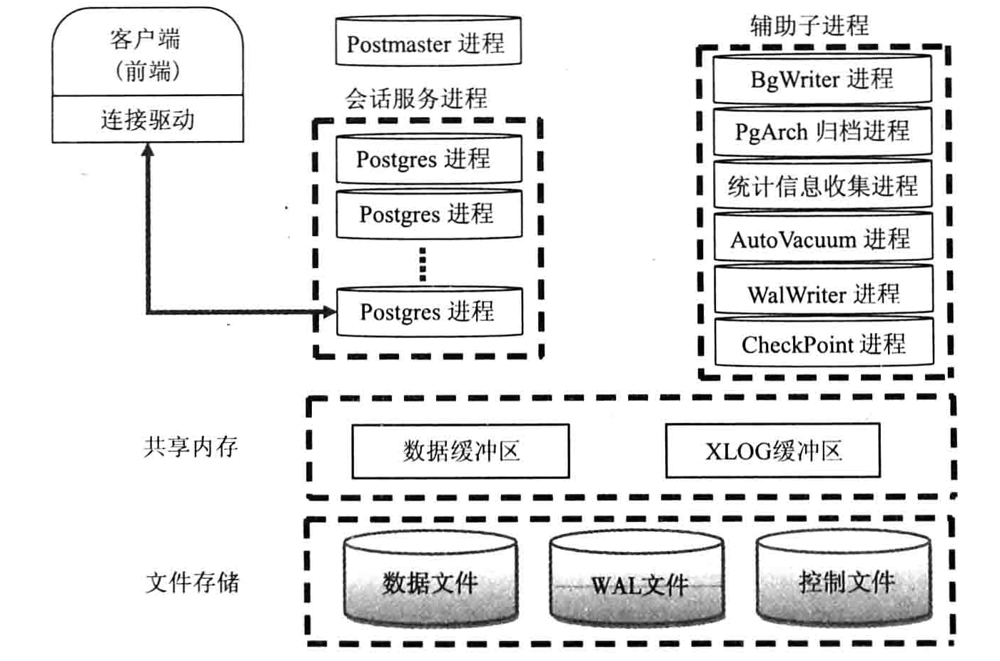

## 逻辑结构

### 簇

### 数据库
默认从template01克隆,可以自定义template1模板,template0是最简的数据库模板

### schema 模式
是一个命名空间或目录,不同模式下面可以有相同的表,函数等对象.只要有权限模式之间可以相互调用.
```sql
create schema schema_name [authorization username] [schema_element ...]
alter schema name rename to new_name; --修改名称
alter schema name owner to new_owner; --修改属主
```
公共模式:创建和访问模式时必须指定模式名,否则默认指定模式为'public'
模式的搜索路径:相当于Linux的$PATH,搜到第一个就返回,未搜到则报错.路径中第一个模式叫当前模式,也是未声明模式时创建对象的模式.
```
show search_path; --查看
set search_path="$user",postgres,osdba; --设置
```
模式权限:默认用户无法访问模式中不属于自己的对象

### Table 表
pg的更新不是直接更新旧数据,而是插入一条新数据和旧数据建立链表,避免更新索引,但链表不能跨数据块,所以新行插入新的数据块则必须重建索引.所以频繁更新的表注意设置fillfactor

```sql
create table t_name(id int,name varchar(20) [default 'ls']),constraint pk primary key(id,name) [...];
-- 以其他表作为模板建表
create table baby (like child [including defaults|indexs|constraints|storages|comments|all]);
```
- Constraint 约束
primary key,foreign key,unique,check,not null

- 表的存储属性
TOAST技术:pg存储页面大小是8KB,且不允许跨页存储,为了突破限制被压缩或行外存储到TOAST表.(四个属性:plain,extened,externa,main)
```sql
alter table t_name alter name set storage extened;--设置name列可以行外存储和压缩
```
- 填充因子(Oracle的pctfree)
fillfactor和toast.fillfactor参数


- 临时表
 
会话级和事务级.与Oracle不同,会话结束临时表也就不存在了(Oracle只是数据消失)

```sql
--默认是会话级的.
create temporary table ... [ on commit preserve rows 保留数据 | delete rows删除数据 | drop]; 
```
- 修改表

```sql
alter table t_name add | drop [clolumn | constraint ] ...;
alter table t_name alter column cname set default ...; ---默认值
alter table t_name alter column cname drop default;
alter table t_name rename column cname to nname; --重命名列名
alter table t_name rename to nname; --重命名表名
```
- 表继承
子表只继承检查约束和非空约束.子表可以继承多个父表,有相同字段时会发生融合(若数据类型不同则报错).select,update,delete,alter table操作父表也会影响子表.但reindex和vacuum不会
```sql
create table persons(name text,sex boolean,age int);
create table students(class_no int) inherits(persons);
--父表可以查到子表记录,反之不能.
select * from only persons;--只查询父表本身记录
```

- 分区表

pg通过继承表实现分区

1.创建父表,所有分区从它继承.该表不存数据也不定义检查约束(约束所有分区除外)
2.创建几个从父表继承的子表,并增加约束定义分区允许的键值
3.对每个分区创建合适的索引
4.定义一个规则或触发器,把对主表的数据插入重定向到合适的分区表
5.确保constraint_exclusion里配置参数postgresql.conf是打开的.智能匹配分区

### 触发器:
行级和语句触发器
触发器行为
触发器特殊变量
事件触发器

### 规则

### 表空间

为表或索引指定存储目录

```sql
create tablespace tbs [owner oner_name] location 'directory';
create database db tablespace tbs;
alter database db set tablespace tbs;--不能有其他人链接到该数据库;
```

### 视图:

### 索引
- B-tree
- Hash
- GiST
一种索引架构,可以实现多种索引策略
- SP-GiST(space-partitioned GiST)
提高GiST索引性能
- GIN
反转索引,与GiST类似.

CONCURRENTLY:并发创建索引关键字,不支持重建索引(但可以通过创建一个新索引把旧索引删除),注意取消创建索引会产生无效索引.

## 用户和权限管理

### 用户管理
```sql
create user|role name with option ...; -- 角色和用户无区别,
option:
    superuser | nosuperuser, -- 只有超级用户才能创建
    createdb | nocreatedb
    createrole | nocreaterole
    createuser|inherit|login|no...
    connection limit num -- 并发数量,默认-1无限制
    encrypted|unencrypted password 'pw';-- 是否加密系统表里的口令
    valid until 'timestamp':-- 不指定永久有效
    in role role_name[,...]:-- 是哪些角色的成员
    role role_name[,...]: -- 将成为新角色的成员
    admin role_name[,...]: --将有新建角色的with admin option权限
```
### 权限管理
####  创建用户时指定的权限
超级用户,创建数据库,login,通过alter role可以更改
```sql
alter role role_name with option ...;
```
#### grant和revoke管理的:
创建模式,临时表,连接某个数据库,创建数据库对象,dml操作,具体的列上select,update,insert,对序列进行查询\使用\更新,声明表上创建触发器,表,索引等建到指定表空间
```sql
grant role_name [,...] to role_name [with admin option];
--建议使用下面的形式
grant some_privileges on database_object_type object_name to role_name;
权限:select,update,insert,delete,truncate,reference,trigger,temp,connect,execute,usage,all [privilegs]

```
## 核心架构
### 进程及内存架构

```
主进程Postmaster(是postgres的一个链接):
    数据库实例的总控进程,负责启动和关闭该数据库实例.并fork出子进程(服务进程).单某个服务进程出错,主进程停掉所有服务进程,然后进行数据一致性恢复

SysLogger进程(系统日志):
    postgresql.conf配置参数logging_collect=on,才会启动SysLogger辅助进程

BgWrite进程(后台写):

WalWrite进程(预写式进程write ahead log,也叫xlog):
    修改数据前,把操作记录数据写入到磁盘,这样就不用实时写入到数据库了,即使数据库宕机也可以通过WAL日志恢复到宕机时的状态
    保存在pg_xlog下,默认16M,会生成多个Wal日志,轮询覆盖

PgArch进程(归档):

AutoVacuum进程(自动清理):
    pg旧数据不会立即删除,更新也不会在旧数据上更新(生成新行),待没有其他并发事务读旧数据才会删除.

PgStat进程(统计数据收集):

共享内存:
    WAL日志和CLOG(commit log)日志缓冲,以及进程信息,锁信息,统计信息等全局信息

本地内存:
    临时缓冲区:访问临时表的本地缓冲
    work_mem:排序,hash
    maintenance_work_mem:维护性操作(VACUUM,CREATE INDEX等)
```
## 目录结构
### 安装目录结构
```
    /usr/local/pgsql11/
                --bin/:可执行文件
                --lib/:pg运行所需动态库
                --include/:头文件目录
                --share/:文档,配置模板文件,扩展包sql文件
```
### 数据目录结构
```
    一般使用环境变量PGDATA指向数据目录(安装时指定,initdb初始化),有以下三个配置文件以及子目录:
        postgresql.conf:数据库实例主配置文件(基本包含所有参数)
        pg_hba.conf:认证配置文件,运行哪些IP访问,认证的方法等
        pg_ident.conf:'ident'认证方式的映射文件
        base:默认表空间目录
        global:共享系统表目录
        pg_clog:commit log目录
        pg_log:系统日志目录
        pg_stat_tmp:统计信息目录
        pg_tblsp:各个用户自建表空间实际目录链接文件
        pg_twophase:两阶段提交功能时分布式事务的存储目录
        pg_xlog:WAL日志目录
```
### 表空间目录
```
    在创建表空间后会生成带有Catalog Version的子目录
    在子目录下又有一些子目录,这些子目录名称就是数据库的oid(11版本好像没有)
```
## 服务管理
### 服务的启停和创建
```
启动:
    1.postgres进程启动:
        postgres -D $PGDATA & 
    2.pg_ctl命令启动:
        pg_ctl start -D $PGDATA
    
停止:
    三种模式:smart shutdown,fast shutdown,immediate shutdown
    1.向postgres主进程发送singal信号:
        SIGTERM:SMART
        SIGINT:FAST
        SIGQUIT:IMMEDIATE
    2.pg_ctl命令:
        pg_ctl -D $PGDATA -m [smart|fast|immediate]

pg_ctl:
    初始化pg_数据库实例
    启动,停止,重启pg服务,查看状态
    让实例重新读取配置
    允许给一个指定的线程发送信号

信号:除停止的三种模式以外的信号
    SIGHUP:等同于函数pg_reload_conf(),重载配置文件
    SIGINT:取消服务进程正在进行的SQL,等同于pg_cancel_backend()
    SIGTERM:pg_terminate_backend()

postgres及单用户模式:
    postgres --single -D $PGDATA
    postgres进程不会进入到后台服务模式,而是进入到一个交互式命令行模式,主要用于以下情况的数据库修复:
        initdb阶段
        多用户不接受所有命令时
        修复系统表
```


