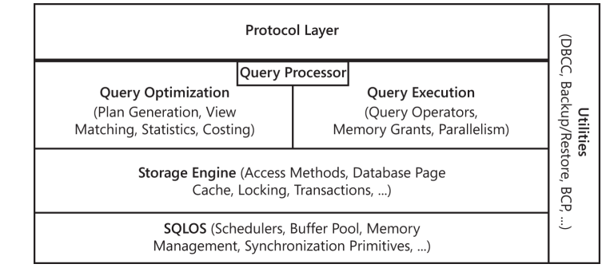
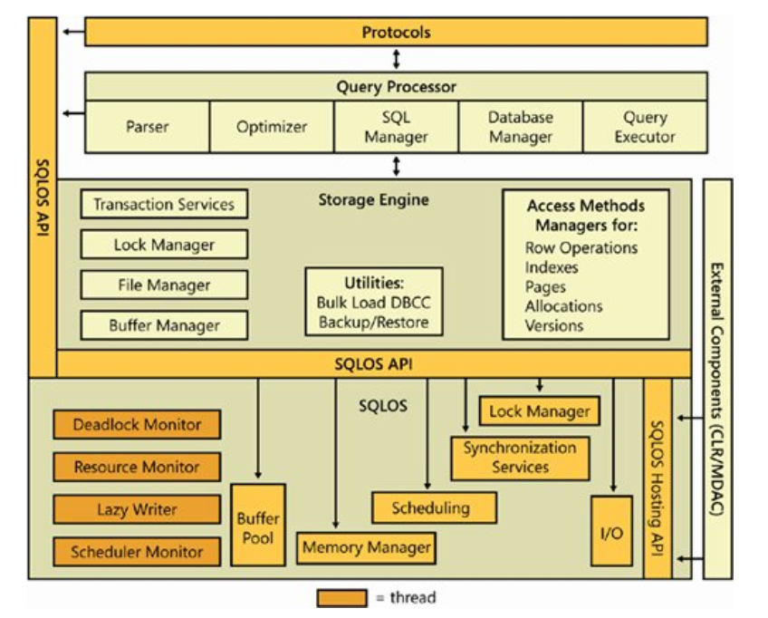

### 1.SQL Server元数据
#### 1.1.Compatibility views
兼容老版本遗留的视图,建议使用catalog views,即视图是sys schema下的
#### 1.2.Catalog views
所有catalog view都是在sys schema下
#### 1.3.Dynamic Management Objects
以sys.dm_开头的视图

分类:

1.dm_exec_*:包含与执行用户代码和关联连接直接或间接相关的信息(例dm_exec_sessions)
2.dm_os_*:包含低级系统信息,如内存和调度(例dm_os_schedules)
3.db_tran_*:包含现在的事务的详细信息(例dm_tran_locks)
4.dm_logool_*:包含用于管理SQL Server日志缓存的日志池的详细信息，这是一个新特性，可使日志记录在需要时更容易检索，比如AlwaysOn
5.dm_io_*:跟踪在网络和磁盘上的输入输出活动(dm_io_virtual_file)
6.dm_db_*:包含数据库和数据库对象的详细信息如索引

#### 1.4.Other metadata

### 2.SQL Server引擎组件

协议层接收请求并把它转换成关系引擎可以处理的形式.还会获取任何查询,状态消息或错误消息的最终结果,并返回给客户端可以理解的形式.    
查询处理器接受T-SQL批并决定如何处理他们,对于T-SQL查询和编程结构,它解析,编译和优化请求,并监督执行批处理的过程.在执行批处理时,如果需要数据,则传递对该数据的请求到存储引擎.    
存储引擎通过基于事务的命令和批量操作管理所有的数据访问,如备份,批量插入和某些数据库控制台命令(database console command,即DBCC)
SQLOS层处理通常被认为是操作系统职责的活动,例如线程管理(调度),同步原语,死锁检测,内存管理,包括缓冲池.

#### 2.1.协议层

当应用程序与数据库引擎进行通信时，协议层公开的应用程序编程接口（API）使用Microsoft定义的格式对通信进行格式化，格式称为表格数据流（TDS）数据包。 SQL Server网络接口（SNI）协议服务器和客户端计算机上的第2层将TDS数据包封装在标准的通信协议（例如TCP / IP或命名管道）中。 在通信的服务器端，网络库是数据库引擎的一部分。 在客户端，网络库是SQL Native Client或OLE DB。 客户端的配置和SQLServer实例确定哪个使用协议。
可以使用以下协议：

- TCP/IP：应用最广泛的协议
- Named Pipes：一种为局域网(LANs)开发的协议。存储器的一部分是一个进程用来将信息传递给另一个进程的，因此一个进程的输出是
另一个的输入。第二个进程可以是本地的(与第一个进程在同一台计算机上)，也可以是远程(网络计算机上)；
- Shared Memory：仅支持在同一台机器上；
VIA（Virtual Interface Adapter）：仅支持高性能 VIA 硬件；（该协议已弃用）
可以对 SQL Server 进行配置，使其可以同时支持多种协议。各种协议在不同的环境中有着不同的性能表现，需要根据性能需求选择合适的协议。
如果客户端并未指定使用哪种协议，则可配置逐个地尝试各种协议。

连接建立后，应用程序即可与数据库进行直接的通信。当应用程序准备使用 T-SQL 语句 "select * from TableA" 向数据库查询数据时，
查询请求在应用程序侧首先被翻译成 TDS 协议包（TDS：Tabular Data Stream 即表格格式数据流协议），然后通过连接的通信协议信道发送至数据库一端。

#### 2.2.查询处理器(也叫关系引擎)  

关系引擎（Relational Engine）也称为查询处理器（Query Processor），主要包含 查询优化器（Query Optimizer）和查询执行器（Query Executor）2 个部分,同时还有解析与绑定(parsing and binding)：

协议层将接收到的 TDS 消息解析回 T-SQL 语句，首先传递给命令解析器（Command Parser）。

命令解析器（Command Parser）检查 T-SQL 语法的正确性，并将 T-SQL 语句转换成可以进行操作的内部格式，即查询树（Query Tree）。

查询树（Query Tree）是结构化查询语言 SQL（Structured Query Language）的内部表现形式。
数据操纵语言 DML（Data Manipulation Language）是 SQL 语言的子集，包括 INSERT, UPDATE, DELETE 三种核心指令。
数据定义语言 DDL（Data Definition Language）管理表和索引结构，包括 CREATE, DROP, ALTER, TRUNCATE 等命令。
数据控制语言 DCL（Data Control Language）负责授权用户访问和处理数据，包括 GRANT, REVOKE 等命名。
T-SQL 即 Transact-SQL 则是在 SQL 基础上扩展了过程化编程语言的功能，如流程控制等。
SQLCLR（SQL Server Common Language Runtime）使用 .NET 程序集来扩展功能。
查询优化器（Query Optimizer）从命令解析器处得到查询树（Query Tree），判断查询树是否可被优化，然后将从许多可能的方式中确定一种最佳方式，对查询树进行优化。

无法优化的语句，包括控制流和 DDL 等，将被编译成内部形式。
可优化的语句，例如 DML 等，将被做上标记等待优化。
优化步骤首先进行规范查询（Normalize Query），可以将单个查询分解成多个细粒度的查询，并对细粒度的查询进行优化，这意味着它将为执行查询确定计划，所以查询优化器的结果是产生一个执行计划（Execution Plan）。

查询优化是基于成本的（Cost-based）考量的，也就是说，选择成本效益最高的计划。查询优化器需要根据内部记录的性能指标选择消耗最少的计划。这些内部性能指标包括：Memory 需求、CPU 利用率和 I/O 操作数量等。同时，查询优化还使用启发式算法（Pruning Heuristics），以确保评估优化及查询的时间消耗不会比直接执行未优化查询的时间更长。

在完成查询的规范化和最优化之后，这些过程产生的结果将被编译成执行计划（Execution Plan）数据结构。执行计划中包括查询哪张表、使用哪个索引、检查何种安全性以及哪些条件为何值等信息。

查询执行器（Query Executor）运行查询优化器（Query Optimizer）产生的执行计划，在执行计划中充当所有命令的调度程序，并跟踪每个命令执行的过程。大多数命令需要与存储引擎（Storage Engine）进行交互，以检索或修改数据等。

#### 2.3.存储引擎  

SQL Server 存储引擎中包含负责访问和管理数据的组件，主要包括：

1.访问方法（Access Methods）
2.锁管理器（Lock Manager）
3.事务服务（Transaction Services）
4.实用工具（Controlling Utilities）

    访问方法（Access Methods）包含创建、更新和查询数据的具体操作，下面列出了一些访问方法类型：
1.行和索引操作（Row and Index Operations）：负责操作和维护磁盘上的数据结构，也就是数据行和 B 树索引。
2.页分配操作（Page Allocation Operations）：每个数据库都是 8KB 磁盘页的集合，这些磁盘页分布在多个物理文件中。SQL Server 使用 13 种磁盘页面结构，包括数据页面、索引页面等。
3.版本操作（Versioning Operations）：用于维护行变化的版本，以支持快照隔离（Snapshot Isolation）功能等。
访问方法并不直接检索页面，它向缓冲区管理器（Buffer Manager）发送请求，缓冲区管理器在其管理的缓存中扫描页面，或者将页面从磁盘读取到缓存中。在扫描启动时，会使用预测先行（Look-ahead Mechanism）机制对页面中的行或索引进行验证。

    锁管理器（Lock Manager）用于控制表、页面、行和系统数据的锁定，负责在多用户环境下解决冲突问题，管理不同类型锁的兼容性，解决死锁问题，以及根据需要提升锁（Escalate Locks）的功能。

    事务服务（Transaction Services）用于提供事务的 ACID 属性支持。ACID 属性包括：
1,原子性（aAtomicity）
2.一致性（Consistency）
3.隔离性（Isolation）
4.持久性（Durability）
预写日志（Write-ahead Logging）功能确保在真正发生变化的数据页写入磁盘前，始终先在磁盘中写入日志记录，使得任务回滚成为可能。写入事务日志是同步的，即 SQL Server 必须等它完成。但写入数据页可以是异步的，所以可以在缓存中组织需要写入的数据页进行批量写入，以提高写入性能。

SQL Server 支持两种并发模型来保证事务的 ACID 属性：

悲观并发（Pessimistic Concurrency）假设冲突始终会发生，通过锁定数据来确保正确性和并发性。
乐观并发（Optimistic Concurrency）假设不会发生冲突，在碰到冲突再进行处理。
在乐观并发模型中，用户读数据时不锁定数据。在执行更新时，系统进行检查，查看另一个用户读过数据后是否更改了数据。如果另一个用户更改了数据，则产生一个错误，接收错误信息的用户将回滚事务。该模型主要用在数据争夺少的环境中，以及锁定数据的成本超过回滚事务的成本时。

SQL Server 提供了 5 中隔离级别（Isolation Level），在处理多用户并发时可以支持不同的并发模型。

Read Uncommitted：仅支持悲观并发；
Repeatable Read：仅支持悲观并发；
Serializable：仅支持悲观并发；
Snapshot: 支持乐观并发；
Read Committed：默认隔离级别，依据配置既可支持悲观并发也可支持乐观并发。

实用工具（Controlling Utilities）中包含用于控制存储引擎的工具，如批量加载（Bulk-load）、DBCC 命令、全文本索引管理（Full-text Index Management）、备份和还原命令等。

#### 2.4.SQLOS

SQLOS 是一个单独的应用层，位于 SQL Server 引擎的最低层。SQLOS 的主要功能包括：

+ 调度（Scheduling）
+ 内存管理（Memory Management）
+ 同步（Synchronization）：提供 Spinlock, Mutex, ReaderWriterLock 等锁机制。
+ 内存代理（Memory Broker）：提供 Memory Distribution 而不是 Memory Allocation。
+ 错误处理（Exception Handling）
+ 死锁检测（Deadlock Detection）
+ 扩展事件（Extended Events）
+ 异步 I/O（Asynchronous IO）

### 3.sql server配置
#### 3.1.sql server browser
#### 3.2.trace flags
#### 3.3.配置动态或静态参数设置(sys.configurations,sp_configure)
#### 3.4.内存分配
#### 3.5.调度

5个影响调度行为的配置选项
+ Lightweight Pooling
+ Affinity Mask
+ Affinity64 Mask, 
+ Priority Boost
+ Max Worker ThreadS

#### disk I/O
+ recovery interval(恢复间隔)
